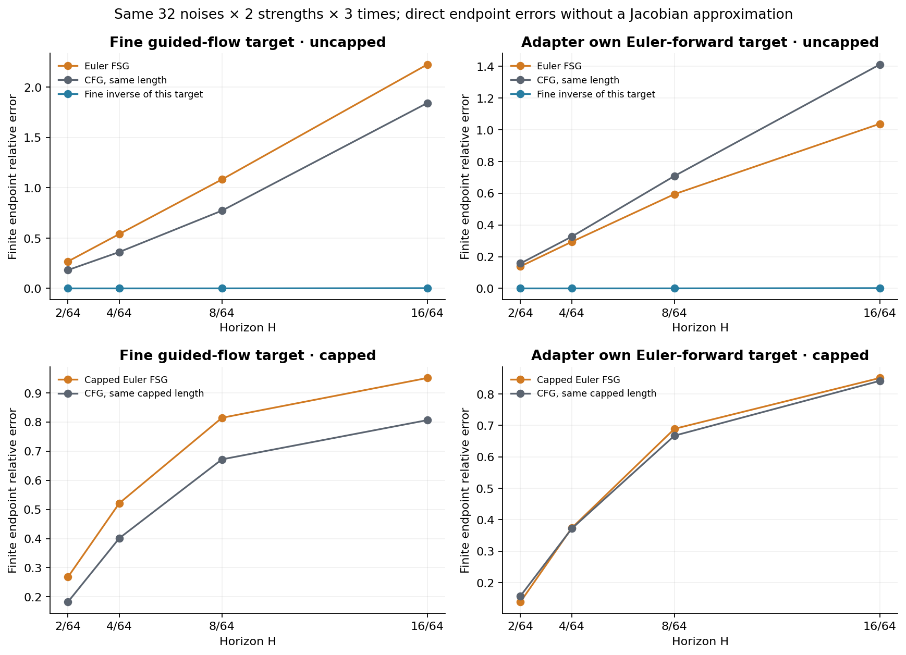

# FSG 的 Jacobian、CFG 系数与前向目标：独立复核结果

**当前检查支持 JVP 的实现；需要纠正的是此前对比较目标的解释。** 原实验使用高精度 guided flow 的终点评价单步 Euler FSG。这能测量它对理想流变换的近似程度，却不足以直接判断它是否比 CFG 更好地反演了自己实际使用的 Euler 前向目标。补测把两个目标分开后，未裁剪 FSG 与同长度 CFG 的排序确实翻转了。

所有比较使用同一 SiT-S/2 权重、同一捕获状态和真 NULL 类别100。补测覆盖32个固定噪声、两档CFG、三个时刻、四档前瞻区间，共5376行；原数据与源文件保持冻结。这里的误差是 latent 终点距离，不是图像质量指标。

先把系数写清楚。代码使用

\[
g=v_c-v_u,\qquad v_w=v_c+a g=v_u+(1+a)g,\qquad w=1+a.
\]

所以，若条件前向本身使用 \(v_w\)，再用 NULL 反演，短程极限是

\[
\delta_* = U_H^{-1}(C_{w,H}(x))-x=Hwg+O(H^2).
\]

本实验的 \(a=1.25,2.75\) 对应 \(w=2.25,3.75\)。只有前向使用原始条件场 \(v_c\) 时，极限才是 \(Hg\)。不能把 \(a\)、\(w\) 或主求解器的步长 \(1/64\) 与前瞻区间 \(H\) 混用。恒定向量场的解析检查已验证这一系数。

实际的方向对照是逐样本计算

\[
\delta_{\rm CFG}=\|\delta_{\rm FSG}\|\frac{g}{\|g\|}.
\]

它与 FSG 的位移范数相同。在 \(H=1/32\) 时，\(\|\delta\|/(H\|g\|)\) 的均值分别为2.1456和3.5234，FSG与CFG完全相同。它不是给CFG另外添加一个自由放大系数。作为额外对照，固定的一阶 \(Hwg\) 也单独保存。

JVP 计算中，\(\hat d=\delta/\|\delta\|\)，实现的是

\[
J_U(x)\delta\approx
\frac{U_H(x+\epsilon\hat d)-U_H(x-\epsilon\hat d)}{2\epsilon}\|\delta\|,
\qquad \epsilon=0.001\max(\|x\|,64).
\]

独立检查包含以下证据：

| 检查 | 结果 | 验证范围 |
|---|---:|---|
| 含时间项的二维仿射系统：中心差分对解析离散 Heun JVP | 相对误差小于 \(1.1\times10^{-13}\) | 方向归一化、步长、链式传播公式 |
| 真实SiT：自动微分对中心差分，16组方向对照 | 相对误差中位数0.0163%，最大0.3342% | 固定编号0、3，两档CFG，\(t=0.375\)，\(H=1/32,1/8\) |
| 同上方向余弦 | 最小0.9999946 | AD与FD方向一致性 |
| 新补测对原实验同目标数值重放 | 最大绝对差 \(4.77\times10^{-7}\) | 相同批大小与状态下的有限终点误差 |

AD与FD使用同一可微 math attention 后端、FP32网络和关闭TF32的矩阵乘。测试验证的是离散8子步NULL Heun映射的方向乘积，没有显式构造4096×4096矩阵。全量有限差分的 \(\epsilon\) 与 \(2\epsilon\) 分辨率并非处处一致：相对差中位数约0.0303%，最大约62.3%，少数长区间方向有明显不稳定性；这也是补测直接计算有限终点、不依赖 JVP 的原因。

补测固定两个不同的目标：

\[
Y_{\rm flow}=C_{w,H}(x),\qquad
Y_E=x+H v_w(x,t).
\]

当前适配器的未裁剪位移为

\[
\delta_E=Y_E-Hv_u(Y_E,t+H)-x.
\]

针对任一固定目标 \(Y\)，直接计算

\[
E_Y(\delta)=\frac{\|U_H(x+\delta)-Y\|}{\|Y-U_H(x)\|}.
\]

下表是32个噪声、两档强度和三个时刻的平均值；单位为百分比，越小表示越接近该列目标。同一比较中的分母相同。

| 目标 | 位移 | \(H=1/32\) FSG | 同长度CFG | \(H=1/8\) FSG | 同长度CFG |
|---|---|---:|---:|---:|---:|
| 精细guided flow终点 \(Y_{\rm flow}\) | 未裁剪 | 26.82 | 18.28 | 108.33 | 77.30 |
| FSG自己的Euler前向终点 \(Y_E\) | 未裁剪 | **13.88** | 15.76 | **59.42** | 70.86 |
| 精细guided flow终点 \(Y_{\rm flow}\) | 实际半径裁剪 | 26.81 | 18.27 | 81.45 | 67.18 |
| FSG自己的Euler前向终点 \(Y_E\) | 实际半径裁剪 | **13.87** | 15.75 | 68.90 | **66.72** |

针对自身Euler目标，未裁剪FSG相对误差比同长度CFG低1.88个百分点（\(H=1/32\)）和11.44个百分点（\(H=1/8\)）。按噪声编号配对、把两档强度与三个时刻保留在同一重采样单元内，95%描述性bootstrap区间分别为降低1.53–2.24和8.95–13.90个百分点。这些区间描述本次样本的稳定性，不是独立质量验证。

裁剪会改变另一件事：**给定方向是否适合一个较小的更新幅度。** 当前半径 \(r=(4/64)a\|g\|\)。在 \(H=1/8\) 时，两个强度的裁剪后系数 \(r/(H\|g\|)\) 只有0.625和1.375，明显小于完整转移所需的一阶2.25和3.75。因此，裁剪位移无法再被当作“完整实现该目标的反演”。本次裁剪后，即使针对自身Euler目标，等长度CFG也略好；这与未裁剪反演方向的结果应分别陈述。

短区间下出现这种差别并不矛盾。记 \(u=v_u\)，所有导数在 \((x,t)\) 处取值，\(D\) 为对状态的导数。光滑场的二阶展开给出

\[
\delta_*=Hwg+
\frac{H^2w}{2}\bigl(\partial_tg+Dg\,u-Du\,g+wDg\,g\bigr)+O(H^3),
\]

而前向与反向都只走一步Euler时，

\[
\delta_E=Hwg-H^2\bigl(\partial_tu+Du\,u+wDu\,g\bigr)+O(H^3).
\]

后一个式子保留了同场Euler往返的公共漂移：即使 \(g=0\)，一般也有 \(-H^2(\partial_tu+Du\,u)\)。所以“更多前向反演运算”本身不保证更接近精细流的目标；它同时带来了离散误差。若改为精细NULL逆流，它对其对应目标的转移误差在 \(H=1/8\) 时仅约0.0376%（精细guided目标）和0.0313%（Euler目标）。这直接支持隐式逆流的数学解释，同时把算子离散误差暴露出来。

理想变换与 Jacobian 的联系应表述为：在目标变化足够小且 \(J_U\) 可逆时，

\[
\delta_*\approx J_U(x)^{-1}\bigl(Y-U_H(x)\bigr).
\]

有限反演本身可以执行非线性变换，不需要先估计完整矩阵；把有限反演位移代入局部线性化仍会留下余项。在原实验 \(H=1/8\) 下，精细反演的有限转移误差约0.0376%，但 \(J_U\delta_*\) 对目标变化的平均相对误差约11.29%。因此，“隐式考虑未来响应”可以成立，“一次JVP已精确解释有限FSG”仍然过强。\(H=1/1024\) 的精细反演短程检查则已接近 \(Hwg\)：平均相对差0.608%，方向余弦0.999980。

此外，局部前瞻的目标只到 \(t+H\)。若之后用NULL完成生成，对应完整终点是 \(U_{t+H,T}(C_{w,H}(x))\)；它不自动等于一路使用原始条件场的 \(C_{t,T}(x)\)。本轮“固定完整条件未来”的图像干预是另一个诊断，应与此处的短区间反演分开理解。

可复核文件：[AD/FD逐项结果](data/sit_fsg_ctrl_hypothesis_20260911/independent_jvp_audit.csv)、[两目标逐样本结果](data/sit_fsg_ctrl_hypothesis_20260911/own_target_rows.csv)、[分强度系数](data/sit_fsg_ctrl_hypothesis_20260911/own_target_means_by_amount.csv)、[配对区间](data/sit_fsg_ctrl_hypothesis_20260911/own_target_paired_intervals.csv)、[AD审计协议](SIT_FSG_JACOBIAN_AUDIT_PROTOCOL_20260911_ZH.md)、[目标补测协议](SIT_FSG_OWN_TARGET_AUDIT_PROTOCOL_20260911_ZH.md)。实现分别为 [AD与解析检查](../experiments/audit_sit_fsg_jacobian_20260911.py) 和 [直接终点补测](../experiments/audit_sit_fsg_own_target_20260911.py)。理论背景使用 [FSG原文](https://arxiv.org/html/2510.21512v1)；此处结果专指本地SiT算子适配，未声称复现原论文全部CFG++流程。
