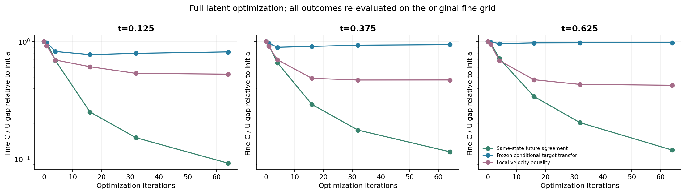
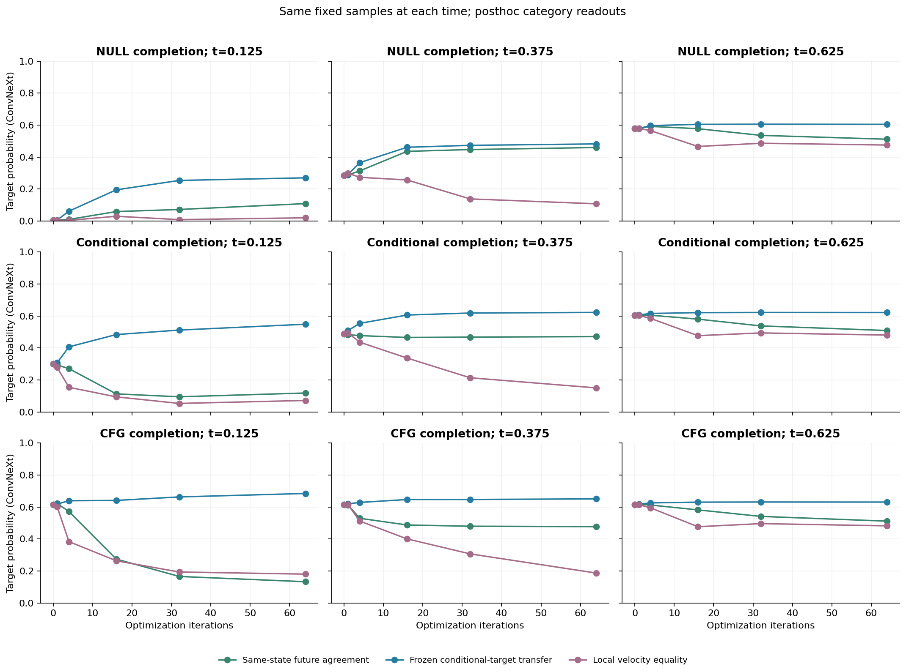

# 直接检验“无条件 = 有条件”：完整图像实验

**图像出现了“更一致，但更差”的实例。** 本次在完整latent上直接优化三个不同的相等目标，固定16个噪声、三个时刻，所有预定实验均已完成。部分NULL结局的类别读出提高；同时存在两条未来接近、但共同偏离原条件图像并丢失结构的实例。不能把分类器概率提高或两条图像相似单独当成质量提高。

这里检验的是显式定义的损失，与FSG SiT适配器的质量比较分开。作者代码并没有直接求解下面的全程一致性损失；其执行情况见[作者代码核对](SIT_FSG_AUTHOR_CODE_AUDIT_20260911_ZH.md)。

记捕获的状态为x₀，U(x)、C(x)分别表示从当前时刻开始、纯NULL和纯条件推进到终点；G(x)表示继续原CFG。比较以下目标，所有模型权重冻结，分类器不参与优化：

|目标|优化损失|条件终点是否可以随状态变化|
|---|---|---|
|同状态未来一致性|‖U(x)−C(x)‖²|可以，两个分支都求导|
|冻结原条件终点|‖U(x)−C(x₀)‖²|原目标固定|
|当前速度相等|‖v_c(x)−v_u(x)‖²|只比较当前预测|

SiT-S/2、ImageNet-100、256px；时间从噪声0到图像1，真NULL为空类别100。固定原机制集前16个噪声与CFG a=1.25轨迹，时刻t=0.125/0.375/0.625；CFG在t≥0.75后使用纯条件分支。完整4096维状态使用64次L-BFGS外层迭代，每批2个状态；损失按逐样本初始MSE归一化，并逐样本回退增大的更新。优化使用12个剩余Heun区间，最终读数重新运行原64网格剩余段，表中报告RMS比值而非MSE比值。每次同时保存NULL、纯条件和CFG终点。

下表只列“同状态未来一致性”目标。每行均为同一组16个噪声，前→后表示原状态与64次优化后的配对均值；类别top1来自后验ConvNeXt，仅是类别对齐读出。

|时刻|细网格U/C差 / 初值|NULL top1 前→后|条件 top1 前→后|CFG top1 前→后|条件终点漂移 / 原U/C差|位移RMS / 半径倍数|
|---|---:|---:|---:|---:|---:|---:|
|0.125|0.092|6.25% → 18.75%|43.75% → 18.75%|81.25% → 25.00%|1.99|0.186 / 22.9×|
|0.375|0.115|43.75% → 62.50%|68.75% → 62.50%|81.25% → 62.50%|4.49|0.281 / 35.8×|
|0.625|0.119|81.25% → 81.25%|87.50% → 81.25%|81.25% → 81.25%|14.79|0.328 / 57.3×|

48个状态的最终细网格U/C差与初值之比：均值 0.109，中位数 0.113，范围 0.042–0.166。其中 16/48 低于0.1。残差明显降低，但并非严格为零。

三种目标的最终结果如下。这里先在每个状态上归一化，再对16噪声×3时刻取均值，避免把初始差异当成改善：

|优化目标|细U/C差 / 初值|对原条件目标的误差 / 初值|当前速度差 / 初值|状态位移RMS|
|---|---:|---:|---:|---:|
|同状态未来一致性|0.109|7.094|0.484|0.265|
|冻结原条件终点|0.911|0.070|1.019|0.030|
|当前速度相等|0.475|8.766|0.112|0.346|

这三个目标的导数也不同：未归一化平方损失的梯度分别为 2(J_U−J_C)ᵀ(U−C) 与 2J_Uᵀ(U−C(x₀))。前者允许条件与NULL一起移动，后者保留要转移的原终点。直接数据因此可以区分“共同未来变得接近”和“原条件结果被NULL复现”。

以下图片固定展示索引0–3，未按结果筛选。最早时刻的键盘样本 #001 是清楚的负例：优化前CFG能看到键盘结构，优化后NULL、条件、CFG三者共同变成缺少键盘结构的褐色图像。中间时刻同一键盘样本仍可识别，但字符与边缘细节改变；Chihuahua样本则进一步丢失面部结构。类别概率与人眼结构判断有时分歧，因此保留两套分类器和全部原始图像。

大位移是本次解释的实际限制。晚时刻原始U/C差和参考半径较小，归一化漂移的分母也较小，需要同时看绝对位移与图片。参考半径r=(4/64)a‖g‖；下表将一致性优化最终位移投影到r或4r，并加入与其完整位移同长度的CFG方向。投影后的状态均重新生成和测量；投影不是约束域内重新优化，因此不能用于断言“所有小位移解均不存在”。

|一致性优化后的对照|细U/C差 / 初值|条件终点漂移 / 原U/C差|CFG目标概率|位移RMS|
|---|---:|---:|---:|---:|
|完整优化位移|0.109|7.09|0.374|0.265|
|投影到r|0.915|0.27|0.612|0.008|
|投影到4r|0.726|0.98|0.588|0.031|
|同长度CFG方向|1.014|9.95|0.593|0.265|

本实验没有验证状态仍位于论文要求的概率流形，也没有达到精确零残差。因此，结果不否定附带流形约束的严格等式假设；它不支持把“一致性损失下降”直接当作图像质量提高的证据。16张不计算FID，也不据此作总体质量排名。原1K实验中的一次4维拟合与这里的完整latent优化也不是同一个方法。

梯度检查的最大AD/中心差分相对偏差为 0.3238%；可微12步求解器与普通12步求解器逐位相同。全部状态数组和请求哈希通过检查，保存状态重算位移RMS最大偏差 2.48e-08，同长度对照、投影半径、各目标原始状态相同及逐样本粗损失不增加均已核验。这些检查没有把粗网格下降替代为细网格结果。

[全部16样本与迭代图册](/home/zhoushunyu/data/eqvae/experiments/sit_fsg_ctrl_hypothesis_20260911/golden_path_direct/gallery.html) · [逐状态结果](data/sit_golden_path_direct_20260911/rows.csv) · [完整优化轨迹](data/sit_golden_path_direct_20260911/optimization_traces.csv) · [数据核验](data/sit_golden_path_direct_20260911/data_audit.json) · [固定协议](SIT_GOLDEN_PATH_DIRECT_PROTOCOL_20260911_ZH.md)。

实验请求SHA256：`834eebbcf4170c0ce248daf774cc2ae0f736261063c85257622acce12d4680dc`。
