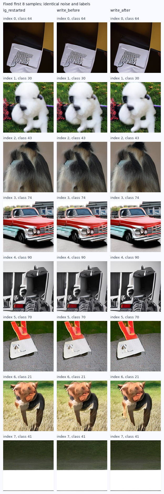

# 小SiT：有限修正流的真实生成对照

本轮两个有限写入方案的FID均落后于同分段普通IG，且均增加约18%的采样与解码成本。
先写入的sFID和IS略好，但没有FID优势；按协议结束这组三配置筛查，不自动扩大步数、幅度或horizon。

状态：complete；完整质量结果 3/3。四卡预检通过后直接做真实1K采样，没有新增toy前置实验。

固定ImageNet-100 SiT-S/2 v800K EMA、depth4 v50K；三组共用历史噪声/标签，
主积分同为Dopri5与0/.125/.25/.375/.5/1分段。额外IG强度为前半段.6/.7、后半段0。
具体操作与冻结范围见[协议](SMALL_SIT_CARRIER_FLOW_PROTOCOL_20260909_ZH.md)。

| 配置 | FID↓ | sFID↓ | IS↑ | Full调用/图 | 总batch GPU秒 | 相对IG成本 |
|---|---:|---:|---:|---:|---:|---:|
| 普通IG，同分段 | 65.139320 | 208.806628 | 35.636852 | 113.776 | 91.60 | 1.000x |
| 先写入，再Strong | 65.972698 | 207.061654 | 36.014774 | 139.344 | 108.13 | 1.180x |
| 先Strong，再写入 | 66.625674 | 211.017320 | 35.076183 | 138.432 | 108.08 | 1.180x |

本轮两个写入方案中最低FID来自先写入，再Strong；相对新普通IG的FID升高1.279%。
这只是已用于历史探索的配对1K结果；不能作为独立确认、最优强度比较或新颖性证据。

历史未分段普通IG为64.851298，历史lifting为65.286964；分段网格不同，均单列为背景。
旧普通IG完整像素已按历史规则删除，本轮没有声称旧像素复现。

写入方案固定原时间，沿D=S−W做4个Heun子步；每个活动段重新读取两头8次，总额外32次Full/图。
这属于Strong流与修正流的标准分裂；当前实验没有证明有限承载等式成立，也没有建立新的高质量固定点。
先写或后写引起的终点变化属于描述性证据，不能替代FID等质量结果。

| 终点对照 | 平均差值RMS | 相对首组RMS |
|---|---:|---:|
| 普通IG，同分段 / 先写入，再Strong | 0.095969 | 0.150094 |
| 普通IG，同分段 / 先Strong，再写入 | 0.086026 | 0.132311 |
| 先写入，再Strong / 先Strong，再写入 | 0.122976 | 0.166519 |

成本是所有batch采样与解码耗时之和，含各组相同的分段记录开销；不含模型加载、入口检查和ADM评价。
每图调用数是各批NFE的平均值；自适应主积分调用数可能不同，两个写入方案只固定辅助调用预算。
官方ADM特征上的FID与sFID经独立FP64样本空间计算核验（误差<.001）；这是算术核验，非独立数据或特征复测。

冻结请求包含采样代码、直接评价入口、模型、VAE及reference身份；`evaluation_dependencies.json`另存ADM实现与Inception图的哈希，
该补充身份记录发生在前两次评价之后，不冒称提前冻结的依赖快照。

冻结请求SHA256：`1fa203149e4ea26c930055db24559d9a51d7c60295f5328b283d4ad7df43ac32`。原始数据：`/home/zhoushunyu/data/eqvae/experiments/small_sit_carrier_flow_20260909`。

[指标CSV](data/small_sit_carrier_flow_20260909/metrics.csv) · [完整审计](data/small_sit_carrier_flow_20260909/audit.json)

固定展示输入索引0–7，没有按结果挑图：

