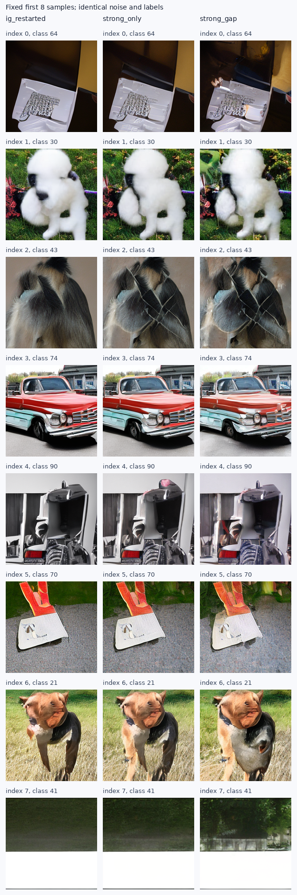

# 小SiT：低成本反馈读出结果

状态：complete；新配置完整1K结果2/2；普通IG完整配对基线复用。

显式读取分歧的候选未改善普通IG的FID；本轮未建立这项低成本构造的生成质量优势。

| 配置 | FID↓ | sFID↓ | IS↑ | Full/图 | 双读出/图 | batch GPU秒 | 相对IG成本 |
|---|---:|---:|---:|---:|---:|---:|---:|
| 普通IG，复用 | 65.139320 | 208.806628 | 35.636852 | 113.776 | 0.000 | 91.60 | 1.000x |
| 只反馈Strong | 67.004976 | 209.125818 | 36.623711 | 111.088 | 68.816 | 112.37 | 1.227x |
| 反馈Strong与分歧 | 80.562647 | 219.232819 | 30.137924 | 108.304 | 65.744 | 109.37 | 1.194x |

每个RHS仍只做一次原生主干；额外Full/prefix均为0。实际总NFE受自适应求解器影响。
同一噪声标签、B8、FP32/TF32、分段Dopri5及原生gamma形状；额外读出只在guidance活动区间启用。
新方案同时改变活动区间的Strong基准和Strong–Weak差值；对照考察显式读取差值的增量。
总成本为全部batch采样与解码之和，不含训练、加载、预检和ADM评价。旧基线并非同一时刻重跑的严格吞吐基准。

每个配置新增58,016参数；固定8192训练图、1024互斥验证图，每图16patch，1000优化步。
一次特征采集与缓存用时5.59秒；两组拟合与过程验证分别2.66、2.67 GPU秒。
上述时间区间包含相应CPU调度／同步；加载和请求哈希开销另计。训练使用真实velocity，固定末步EMA，没有按验证或FID选检查点。

| 配置 | 验证Strong MSE | 验证Weak MSE | 验证guided MSE | 验证gap均方 |
|---|---:|---:|---:|---:|
| 原生读出 | 0.676192 | 0.743620 | 0.706625 | 0.066690 |
| 只反馈Strong | 0.680478 | 0.725274 | 0.708073 | 0.050815 |
| 反馈Strong与分歧 | 0.680521 | 0.688029 | 0.692369 | 0.014901 |

验证MSE来自真实图加噪的固定patch集合，不能直接替代生成FID；分歧缩小也不是成功判据。

| 配置 | 单RHS耗时比，中位数 | 引导场改变量/原场RMS | 新旧gap RMS比 |
|---|---:|---:|---:|
| 只反馈Strong | 1.1681x | 0.124033 | 0.910149 |
| 反馈Strong与分歧 | 1.1500x | 0.163444 | 0.526817 |

单RHS计时使用固定同一batch-state、预热后30次调用；不是端到端速度。
所有采样进程退出后，另做固定状态的隔离计时，分别移除RMS诊断、保留真实读出计算。
Strong-only与Strong+gap纯读出RHS的耗时比为1.0992x、1.1032x。
6轮循环调整计时顺序，每轮每方法50次；纯读出与带诊断实现在该输入上逐元素相同。
这约10%的固定RHS开销不等于全轨迹重新实测的成本；上表的实际生成成本仍包含原诊断。
[隔离成本记录](data/small_sit_feedback_reader_20260909/cost_audit.json)。

RMS诊断按活动RHS查询加权，包括自适应求解器拒绝的试探步，不是只统计接受轨迹。
零读出、原生线性层捕获、patch往返、普通IG首批latent复现和零gamma退化均做真实网络检查。
数据、模型、源码、两个新读出、噪声标签、全部125个batch及ADM评价身份已核验。
FID/sFID用相同缓存特征上的独立FP64公式复算；不是独立特征提取或独立数据确认。

首次训练在第一个原模型调用的embedding处因int16标签退出；显式转换为int64后重新冻结训练请求。
修复前没有采集缓存、优化器更新或生成质量结果；原请求、源码和失败原因保存在amendments/01_label_dtype。

本轮只做一次缓存特征读出更新，没有证明计算固定点存在、收敛或具有质量含义。
已有探索噪声bank反复使用，当前结果不能充当独立确认。完整研究目标未达成。

生成请求SHA256：`3f4f36bd12c1cda4bf8245497c526193e8d335d7ac8f6e2256ca6aa05afdf3fc`；原始资产：`/home/zhoushunyu/data/eqvae/experiments/small_sit_feedback_reader_20260909`。

[冻结协议](SMALL_SIT_FEEDBACK_READER_PROTOCOL_20260909_ZH.md) · [指标](data/small_sit_feedback_reader_20260909/metrics.csv) · [审计](data/small_sit_feedback_reader_20260909/audit.json)

固定首8张，未按质量挑选：

