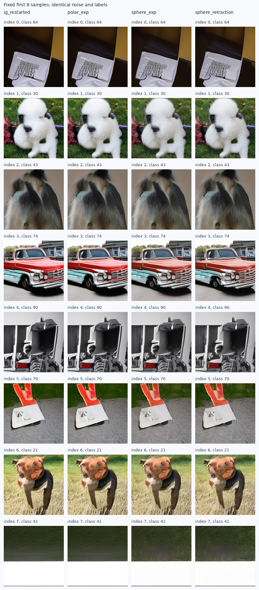

# 小SiT：非线性预测组合的质量结果

状态：complete；完成4/4组，每组1000张。

全部非线性候选的FID都未改善普通IG。本轮固定构造的质量假说未获支持。
不继续为这几项候选搜索角度、归一化强度或组合参数，也不把它扩大为所有非线性方法无效。

| 配置 | FID↓ | sFID↓ | IS↑ | Full/图 | 采样＋解码GPU秒 | 相对本轮IG成本 |
|---|---:|---:|---:|---:|---:|---:|
| 普通IG，本轮重跑 | 65.136864 | 208.806059 | 35.634354 | 113.776 | 91.499 | 1.000x |
| 径向乘法＋有限旋转 | 65.831589 | 208.664743 | 34.983696 | 114.976 | 100.362 | 1.097x |
| 仅有限旋转 | 65.689309 | 208.188518 | 35.573795 | 110.464 | 95.374 | 1.042x |
| 线性后等范数归一化 | 65.845266 | 208.367512 | 35.750343 | 110.080 | 95.689 | 1.046x |

Strong/Weak、噪声和类别、引导强度、Dopri5容差、分段网格及解码器逐项匹配。
每次RHS一次主干调用，零新增模型参数；自适应NFE及几何运算会影响实际成本。
上表为跨batch累加的实测采样和解码GPU时间，包含逐查询诊断；不含加载、预检和FID评价，也不是四卡墙钟时间。

主候选在clean预测坐标中执行径向乘法与有限旋转，小强度一阶等于普通IG。
纯旋转保持Strong预测长度；归一化对照先做线性IG再恢复Strong长度，因此后者本身包含线性外推。
这几项不增加新模型信息，不证明潜变量posterior mean具有球面几何。

| 候选 | 平均转角参数/rad | 平均clean长度比 | 修正/原线性修正长度 | 偏离原仿射线的能量比例 | 退化回退比例 |
|---|---:|---:|---:|---:|---:|
| 径向乘法＋有限旋转 | 0.214219 | 1.065786 | 1.030040 | 0.012855 | 0.000000 |
| 仅有限旋转 | 0.219727 | 1.000000 | 0.933706 | 0.177996 | 0.000000 |
| 线性后等范数归一化 | 0.203659 | 1.000000 | 0.874619 | 0.167560 | 0.000000 |

统计覆盖实际采样所有非零guidance的RHS查询（含Dopri5拒绝的查询），按查询和图像加权。
仿射线残量针对 `v-S` 在 `S-W` 的正交分量。其非零说明该状态不能由一个标量IG精确表示，
不等于证明整个输出分布不能由其他IG策略取得。完整分段诊断保存在geometry文件。

已核验完整batch覆盖、全部输入/源文件/权重/参考哈希；FP64独立复算FID和sFID。
独立复算使用同一缓存Inception特征，不是独立特征提取或独立真实参考。
CPU稠密矩阵指数核对1152例，最大clean误差9.35e-14。
本轮原生IG全部1000张latent及像素与历史基线逐位相同；成本为本轮重新测量。
同像素重复ADM评测的FID变化-0.002456；两次缓存特征并非逐位相同，pool_3差异RMS为0.000883609。
这项重复提取差异的具体根因尚未定位；独立FID复算核对的是本轮缓存特征。所有候选使用本轮IG作为对照，不把旧FID差异算作采样效果。

用户指出构造缺乏生成直觉与理论依据后，本轮停止扩展。旋转/范数等式仅说明几何性质，不能决定为何应当采用该几何。
后续[理论重审](IG_HYPOTHESIS_POSTERIOR_RETHINK_20260910_ZH.md)从近似推断偏差与候选后验出发，尚不是已验证的新方法。

[冻结协议](SMALL_SIT_NONLINEAR_PREDICTION_PROTOCOL_20260909_ZH.md)；[完整数值](data/small_sit_nonlinear_prediction_20260909/metrics.csv)；[核验记录](data/small_sit_nonlinear_prediction_20260909/audit.json)。
相关方法已有[ADG](https://arxiv.org/html/2506.11039v1)与[APG](https://arxiv.org/html/2410.02416v2)，本轮不作首次非线性guidance的主张。

固定最前8张用于核查实现与可见变化，不能代表整体质量。
原始文件：`/home/zhoushunyu/data/eqvae/experiments/small_sit_nonlinear_prediction_20260909`。原论文研究目标仍未完成。
