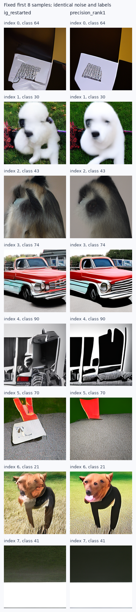

# 小SiT：精度平衡候选的真实生成结果

状态：paused_after_numerical_review；新配置完整质量结果1/2；同分段普通IG复用。

这轮从FSG的信息承载问题出发，测试局部后验精度加权的残差平衡。
数学动机、可表达性限制与非零头差的等式见[理论记录](IG_FIXED_POINT_MESSAGE_GEOMETRY_20260909_ZH.md)，
实际低维近似、数值条件和失败处理见[冻结协议](SMALL_SIT_PRECISION_BALANCE_PROTOCOL_20260909_ZH.md)。

| 配置 | FID↓ | sFID↓ | IS↑ | Full/图 | batch GPU秒 | 相对IG成本 |
|---|---:|---:|---:|---:|---:|---:|
| 普通IG，复用 | 65.139320 | 208.806628 | 35.636852 | 113.776 | 91.60 | 1.000x |
| 一维精度平衡 | 88.259677 | 226.970754 | 26.412336 | 2300.592 | 1555.54 | 16.982x |

在数值/成本复核后中止二维配置，保留192张完整落盘样本；不计算或报告部分样本FID。
一维配置FID明显恶化，二维前几批还出现约8000次Full/图和极端系数放大。此实现不具备继续补满质量采样的价值。
原冻结代码和数值规则没有修改；人工中止记录、原状态与完整batch保留。这不是声称未完成的二维FID必然更差。

相同模型、noise、标签、主Dopri5精度与五段边界；首批普通IG latent逐元素复现，zero-gamma退化检查通过。
原计划每个新配置1K，实际完成数以上方状态为准；输入来自已有探索bank，没有训练新参数。全部成本为采样与解码的batch耗时之和，不含预检和ADM评价。

| 候选 | 回退普通IG比例 | 采用一维比例 | 采用二维比例 | 查询加权有效alpha | 正交修正/普通修正 |
|---|---:|---:|---:|---:|---:|
| 一维精度平衡 | 8.2692% | 91.7308% | 0.0000% | 62.075935 | 0.000000 |

上述读数覆盖自适应求解器的所有活动RHS查询，包括被拒绝的试探步；不是均匀时间采样，也不是只统计接受的轨迹。
因此大系数可能出现在求解器拒绝的状态上；NFE和实际耗时仍完整计入。
投影Jacobian取对称部分、近奇异时回退，属于预先固定的近似规则，不能据此认证真实后验合法性。

真实网络预检的64个状态/样本中，将差分位移从1%减为0.5%后，输出相对变化中位数0.004694、最大值0.983492。
这是实际数值敏感性，入口与零强度检查通过并不意味着局部响应估计稳定。现有质量结果属于固定1%实现，不能当作精确Jacobian或精确Gaussian后验的结果。

采样停止后，对相同的64个检查状态做一阶反向自动微分。固定1%差分定义的同一组基，避免把基变动与导数误差混在一起。
Strong/Weak的对称投影响应分别在64/64和64/64个检查点正定；组合矩阵只有21/64个正定。
因此不适定性不能全部归因于有限差分精度。这个局部Gaussian近似的可归一化前提经常不成立；这不等于证明原始神经模型对应的真实密度不可归一化。
1%差分相对自动微分的矩阵误差中位数：Strong 0.005566、Weak 0.000973；
最大误差分别为0.239600、0.008842。原始逐状态记录见[导数审计](data/small_sit_precision_balance_20260909/derivative_audit.json)。

ADM缓存特征上的FID/sFID经独立FP64样本空间公式核验；不是独立特征提取或独立数据确认。
请求SHA256：`08780fd1b55aa4f960e23c5e8a1b83749a51fcce93037282507d2a03174b2a10`；原始资产：`/home/zhoushunyu/data/eqvae/experiments/small_sit_precision_balance_20260909`。

[指标](data/small_sit_precision_balance_20260909/metrics.csv) · [审计与数值敏感性](data/small_sit_precision_balance_20260909/audit.json)

输入索引0–7固定展示，未按效果挑图：

