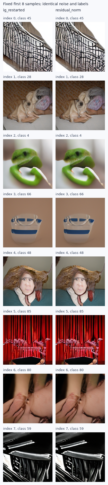

# 小SiT：可预测分歧候选的新噪声5K结果

状态：complete；已完成2/2组，每组5000图。

固定候选在本轮新噪声5K中FID改善1.272%，实际采样/解码成本为原生IG的1.031倍。
这是一个模型、一组新噪声的结果；不据此宣称固定点、全模型普适性或论文目标达成。

| 配置 | FID↓ | sFID↓ | IS↑ | Full/图 | batch GPU秒 |
|---|---:|---:|---:|---:|---:|
| ig_restarted | 41.503420 | 70.233480 | 36.827980 | 114.688 | 472.772 |
| residual_norm | 40.975627 | 70.312665 | 36.737942 | 115.062 | 487.320 |

两组使用完全相同的新噪声和新标签：单CUDA Generator连续B8绘制，noise seed202609981；每类50图，独立标签shuffle seed202609982。
没有重训、改变guide窗口/强度、选择检查点或使用新5K拟合参数。原生IG也在本轮重新采样；采样/解码成本包含候选的实际逐查询诊断。
固定候选只增加6160个线性系数和标准化统计，使用原生一次Full中的浅层特征；主干、强头、旧weak头不更新。
具体构造：记D=S−W，C(H)为仅从浅层条件特征H拟合D的仿射读出，R=D−C(H)，R̂=||D||R/||R||；新速度为S+αR̂。
全图范数退化时的回退规则与1K一致；本轮实际没有触发回退。这里先形成新方向，再保持原gap长度。
此处并未将“可预测”解释成有害或多余的真实信息；它是固定仿射函数族的操作性分解。

旧1K原生/候选为65.139320/64.972278，平行分量对照65.567291；不要直接用1K和5K的绝对FID作改善比较。
新5K未重复parallel组，因此没有独立确认该方向因果对照。真实ADM参考、模型训练与读出拟合资产均共用；只更换质量采样的噪声和标签。

在候选5K的实际查询上，R与D的平均余弦约0.941，等长残差的正交能量比例约11.33%。在出现非零正交分量的状态上，该向量场不能由单一scalar IG系数精确表示。
这不证明其优于重新优化后的普通IG强度曲线，也不等于生成分布不可由别的采样方案近似；质量结论仍只限本次固定配置。
剩余部分更难被这个便宜读出预测，并不意味着它更接近真实数据、具备更多Shannon信息或自动具有guidance价值。当前的正向FID是实验结果，不是回归正交性定理的推论。

四卡在正式5K前分别复现旧原生与旧候选的首批latent，均逐元素相同。新bank的norm恒等式通过；每组625个batch覆盖、输入、标签、权重、源码与评估图身份均核对。
独立FP64核算使用对称协方差平方根的特征空间公式，与ADM实现不同；仍共用缓存Inception特征，不是独立特征提取。

[冻结5K协议](SMALL_SIT_PREDICTABLE_GAP_CONFIRMATION_PROTOCOL_20260909_ZH.md) · [1K探索结果](SMALL_SIT_PREDICTABLE_GAP_RESULTS_20260909_ZH.md) · [5K指标](data/small_sit_predictable_gap_confirmation_20260909/metrics.csv) · [审计](data/small_sit_predictable_gap_confirmation_20260909/audit.json)

原始产物：`/home/zhoushunyu/data/eqvae/experiments/small_sit_predictable_gap_confirmation_20260909`；请求SHA256：`b5f8837245e84cff2ce0d9c57a212ea057dc05f46cf48ca1db9f8064d3c58aa0`。

固定最前8个新输入，无质量选择：

