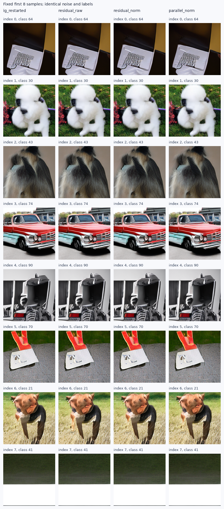

# 小SiT：浅层可预测分歧的质量结果

状态：complete；完成的新配置3/3，另复用完整原生IG基线。

等长残差方向在本轮探索1K上优于普通IG和仅平行分量对照，形成初步方向信号。
尚不能据此认定总体改善、解释了深度信息或实现论文目标。

| 配置 | FID↓ | sFID↓ | IS↑ | Full/图 | batch GPU秒 | 相对旧IG成本 |
|---|---:|---:|---:|---:|---:|---:|
| 原生IG，复用 | 65.139320 | 208.806628 | 35.636852 | 113.776 | 91.597 | 1.000x |
| 去除可预测部分 | 65.246903 | 209.846990 | 35.460663 | 113.920 | 95.483 | 1.042x |
| 残差与原gap等长 | 64.972278 | 209.690203 | 35.169975 | 113.344 | 96.403 | 1.052x |
| 仅保留平行分量 | 65.567291 | 208.903882 | 35.624134 | 113.248 | 95.896 | 1.047x |

同一1000个噪声和类别、B8、原生网格、Dopri5容差与解码器；每个RHS只有一次原生主干调用。
新条件增加6160个线性系数及标准化统计量，强头没有改变，也没有读取深层特征作为回归输入。
总成本包含实际采样、逐查询诊断与解码，另有拟合、加载、预检和评价成本。旧基线不是同期吞吐复测。
固定同状态预热后30次RHS计时，4个rank的相对耗时中位数：residual_raw 1.0976x，residual_norm 1.0952x，parallel_norm 1.0951x。该计时包含实际诊断，不是端到端重测。

在已缓存的131072个训练token上，FP64拟合及方程/权重保存耗时0.2234秒，不含cache加载和后续验证。
原cache来自8192训练图，一次前向采集成本5.5873秒，属于前一轮已支付并复用的成本；不把缓存视为免费外部资源。
留出16384个token上，残差能量是原gap的0.931281倍，减少6.872%。
这只是受限仿射预测能力，不是有害成分的比例，也不是生成质量证据。

| 配置 | R/D长度比 | C/D长度比 | cos(R,D) | 等长残差正交能量比 | 回退比例 |
|---|---:|---:|---:|---:|---:|
| 去除可预测部分 | 0.945382 | 0.325130 | 0.940705 | 0.113617 | 0.00000000 |
| 残差与原gap等长 | 0.945177 | 0.324355 | 0.940910 | 0.113220 | 0.00000000 |
| 仅保留平行分量 | 0.945457 | 0.326161 | 0.940409 | 0.114180 | 0.00000000 |

上表按所有活动RHS查询加权，包括自适应积分拒绝的试探；各配置走自己的状态，不能把跨行差异当成同状态因果估计。
parallel组只检验norm方向新增正交分量的价值；原始残差改善若存在，也可能来自有效强度变化。

SciPy从保存的正规方程独立求解，系数最大差3.164e-15。真实模型上GPU读出与NumPy矩阵乘法、
弱头原生线性读出、norm/parallel几何恒等式、零α以及禁用新操作的原生IG首批latent均通过检查。
首次预检中TF32新读出与高精度NumPy的最大误差约0.00038–0.00042，超过预设0.0003；正式质量batch为0。
仅将新线性读出的乘法改为完整FP32，并立即恢复主干的TF32设置，原拟合系数不变；新源与修订重新冻结后全部预检通过。
原请求、失败日志、修订前后源码和系数身份保留在原始目录amendments/01_projection_precision。
所有配置各125个batch覆盖、噪声标签、模型/源码/cache/投影参数/评价图哈希均核对；FID和sFID用相同特征上的FP64公式复算。
这不是独立特征提取，重复探索bank也不是独立样本确认。

深层特征是浅层特征的确定性后续计算；这里的“可预测”仅相对于固定、廉价、局部的仿射读出族。
移除可预测项没有质量保证，也不是新的残差化原理。既有文献和旧失败对照见冻结协议。

[冻结协议](SMALL_SIT_PREDICTABLE_GAP_PROTOCOL_20260909_ZH.md) · [指标](data/small_sit_predictable_gap_20260909/metrics.csv) · [完整审计](data/small_sit_predictable_gap_20260909/audit.json)

原始产物：`/home/zhoushunyu/data/eqvae/experiments/small_sit_predictable_gap_20260909`；采样请求SHA256：`6295b85fa6cfed4181e359740df7b42dd2265164dfbc6ae9ec9811debcd84f2d`。

固定最前8张，无质量筛选：

