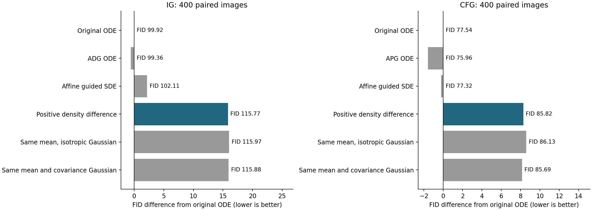

**有限随机转移的正性去污染：CFG 与 IG 固定生成实验**

两条路线均未通过固定筛选，停止这一有限转移构造。

本轮完成12组、每组400张，共4800张全新图像。IG使用已验证的MLP弱读出，CFG使用原条件及无条件预测。没有新增训练、弱主干、来源分类器或额外前缀，也没有根据生成结果修改参数。两个噪声bank独立，分别使用seed2026121431与2026121433，均衡100个本地类别。

| track   | arm             |      fid |   inception_score |   samples |   full_calls |   prefix_calls |
|:--------|:----------------|---------:|------------------:|----------:|-------------:|---------------:|
| ig      | ode             |  99.9235 |           36.4831 |       400 |          128 |              0 |
| ig      | ode_competitor  |  99.3572 |           36.0929 |       400 |          128 |              0 |
| ig      | sde             | 102.1144 |           33.3938 |       400 |          128 |              0 |
| ig      | positive        | 115.7732 |           28.6876 |       400 |          128 |              0 |
| ig      | mean_gaussian   | 115.9701 |           28.9190 |       400 |          128 |              0 |
| ig      | moment_gaussian | 115.8820 |           28.6066 |       400 |          128 |              0 |
| cfg     | ode             |  77.5378 |           60.8709 |       400 |          224 |              0 |
| cfg     | ode_competitor  |  75.9559 |           60.4882 |       400 |          224 |              0 |
| cfg     | sde             |  77.3241 |           61.7986 |       400 |          224 |              0 |
| cfg     | positive        |  85.8240 |           51.8454 |       400 |          224 |              0 |
| cfg     | mean_gaussian   |  86.1287 |           51.6358 |       400 |          224 |              0 |
| cfg     | moment_gaussian |  85.6922 |           51.2941 |       400 |          224 |              0 |

每条路线内部所有随机臂的初始噪声、类别与128步Gaussian随机数配对。原ODE及竞争基线使用64步Heun；随机臂使用128步Euler。IG各臂128次full，CFG各臂224次full，额外prefix均为0。ODE与SDE不同，因此收益必须同时超过普通guided SDE，不能只与ODE比较。CFG竞争基线是仓库既有APG velocity历史适配，IG竞争基线是同MLP读出的ADG。

| track   | passes_gate   |   candidate_fid | best_control   |   best_control_fid |   difference |
|:--------|:--------------|----------------:|:---------------|-------------------:|-------------:|
| ig      | False         |        115.7732 | ode_competitor |            99.3572 |      16.4160 |
| cfg     | False         |         85.8240 | ode_competitor |            75.9559 |       9.8681 |

门槛要求候选比同路线全部五个控制至少低2 FID，且IS达到原ODE的90%。这是固定继续/停止规则，不是统计显著性检验。400图只提供筛选证据，不能和不同样本数或旧bank的绝对FID交叉比较。

IG候选相对原ODE的FID差为+15.8497，相对普通SDE为+13.6588，相对均值匹配Gaussian为-0.1969，相对均值及协方差匹配Gaussian为-0.1087。这些对照用于区分有限转移分布形状、平均漂移与二阶矩；不将候选和矩对照接近自动解释成某一个机制已被识别。

CFG候选相对原ODE的FID差为+8.2862，相对普通SDE为+8.4998，相对均值匹配Gaussian为-0.3047，相对均值及协方差匹配Gaussian为+0.1318。这些对照用于区分有限转移分布形状、平均漂移与二阶矩；不将候选和矩对照接近自动解释成某一个机制已被识别。

候选把原来的密度去污染动机放到每一步的条件转移上。对于两个近似Gaussian转移S、W，定义

\[Q=\frac{[S-\kappa W]_+}{\int[S-\kappa W]_+}.\]

它是有符号反演A=(S-kappa W)/(1-kappa)的一个最近TV概率修复：A的负质量给出任何概率修复所需TV改变量的下界，归一化正部分达到此下界，但解不必唯一。该性质保证合法转移，不保证接近真实数据。

这是一项额外的转移核假设，不能由端点共同污染自动推出。不同均值、相同协方差的两个Gaussian本来就不能满足全空间正比例去污染；正部分操作承认并修复这一失配。其修复范围限于正性，没有识别真实错误成分、卷积核或一般加性误差。

采样时令mu_i=z+h*((1+t*(1-t))*v_i-(1-t)*z)，sigma=sqrt(2*h)*(1-t)。这是选择扩散方差率2*(1-t)^2后对相应SDE做Euler离散。在精确共同Gaussian前向族条件下，所加漂移与扩散保持同一边缘；冻结近似网络和有限步离散不保证该等价。[1]

因为两个转移协方差相同，密度比只依赖均值差方向上的一个标量。令d=||mu_w-mu_s||/sigma，kappa=alpha/(1+alpha)，则标准化标量密度正比于[phi(u)-kappa*phi(u-d)]_+，支持u<c=d/2-log(kappa)/d。其余方向保留标准Gaussian。它改变完整转移分布；均值匹配与协方差匹配两臂是独立的控制。

固定维数且步长趋零时，d=O(sqrt(h))，正部分截断消失，均值回到普通affine guidance，协方差改变量为O(h^2)。因此连续极限仍为普通guided SDE；本次研究的是有限步修复，而非新的连续极限理论。原alpha和窗口仅用于小步幅度匹配，不能称为估计到污染比例。

逆CDF采用三个固定1025×1025 FP32表，d轴按sqrt(d)取网格。独立数值积分核验了21个归一化、均值、方差及TV距离案例，并用100000次随机抽样检查采样分布。18000个抽查点的最大标准化偏移误差为0.000363127。标准Gaussian投影超出±7的概率约2.56e-12；表范围外采用截断数值约定，不能称无限精度精确采样。

原IG、CFG的完整ODE轨迹与旧实现逐项相同，CFG的APG轨迹也逐项相同。所有随机臂的零引导分支逐项相同，普通SDE与独立显式漂移重放逐项相同。正式每批保存全部层调用数、头调用数、噪声与类别、随机增量种子、FP32终态和像素；权重、源代码及输入请求hash核验通过。

同卡轮换预热后各计时三次，batch8，包含采样、VAE解码及像素转换。下列时间与并行质量采样日志分开；只有三次重复，不给精确延迟置信区间。

| track   | arm             |   median_seconds |
|:--------|:----------------|-----------------:|
| ig      | ode             |         0.762278 |
| ig      | ode_competitor  |         0.800197 |
| ig      | sde             |         0.771236 |
| ig      | positive        |         0.785805 |
| ig      | mean_gaussian   |         0.797862 |
| ig      | moment_gaussian |         0.796435 |
| cfg     | ode             |         1.204868 |
| cfg     | ode_competitor  |         1.237759 |
| cfg     | sde             |         1.209493 |
| cfg     | positive        |         1.228453 |
| cfg     | mean_gaussian   |         1.251028 |
| cfg     | moment_gaussian |         1.249810 |

候选没有新增可训练参数，查找表占12.02 MiB。IG与自己的MLP基线相比没有新增读出参数；CFG算法不调用弱头。比较运行时为共用两条路线加载了MLP与全部查找表，其总显存不能冒充纯CFG最小部署显存。

全部4800张及批次元数据已核对。对同一ADM缓存特征使用FP64对称Gram公式复算FID，最大绝对差5.34408e-05。这是同特征复算，不是另一套独立特征提取器验证。

线性污染和自适应系数已有Feedback Guidance先例；概率流叠加和相应SDE族已有SuperDiff等先例。[1][2] 本次结果不建立新颖性，也不把有限转移密度的合法性等同于生成质量。完整误差假设仍需同时处理实际分布错配与网络近似误差。

[冻结协议](TRANSITION_DECONTAMINATION_PROTOCOL_20260913_ZH.md) · [采样实现](../experiments/transition_decontamination_20260913/core.py) · [转移核实现](../experiments/transition_decontamination_20260913/kernel.py) · [源数据工作簿](data/transition_decontamination_20260913/source_data.xlsx) · [核验记录](data/transition_decontamination_20260913/verification.json)。

[1] Skreta 等，The Superposition of Diffusion Models Using the Itô Density Estimator，2025-02-28，Proposition 1及§2–3：[原文](https://arxiv.org/html/2412.17762v2)。

[2] Koulischer 等，Feedback Guidance of Diffusion Models，2025，§3：[原文](https://arxiv.org/html/2506.06085v2)。
