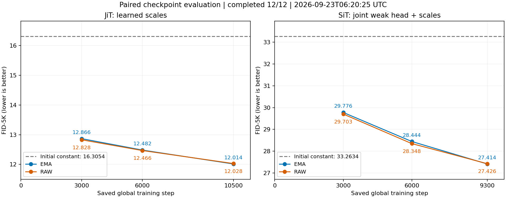

# 两组 GAN 的 checkpoint FID-5K 评估

实时更新：2026-09-23T06:20:25.745655+00:00；完成 12/12 组。

每组均为 5,000 张，raw 与 EMA 分开测。SiT 的 weak head 与 scale 必须来自同一套 raw/EMA。每个模型内部复用原固定噪声和标签，不改变系数曲线、NFE、精度、像素量化与 FID 参考集。

JiT：ImageNet-1000，每类 5 张，50 intervals / 99 NFE，无 CFG，初始全程 a=0.5。SiT：ImageNet-100，每类 50 张，64 Heun / 128 NFE，初始全程 a=0.75。两模型的 FID 参考集不同，绝对值不作跨模型排名。

| 模型 | 存档步数 | 权重 | FID-5K | 相对初始 ΔFID | 状态 |
|---|---:|---|---:|---:|---|
| jit | 0 | 初始常数 | 16.305372 | 0 | 复用已核验基线 |
| jit | 3000 | ema | 12.866076 | -3.439296 | 完成 |
| jit | 3000 | raw | 12.827598 | -3.477774 | 完成 |
| jit | 6000 | ema | 12.482135 | -3.823236 | 完成 |
| jit | 6000 | raw | 12.466478 | -3.838893 | 完成 |
| jit | 10500 | ema | 12.014414 | -4.290958 | 完成 |
| jit | 10500 | raw | 12.028480 | -4.276892 | 完成 |
| sit_small | 0 | 初始常数 | 33.263440 | 0 | 复用已核验基线 |
| sit_small | 3000 | ema | 29.776341 | -3.487099 | 完成 |
| sit_small | 3000 | raw | 29.702904 | -3.560536 | 完成 |
| sit_small | 6000 | ema | 28.444252 | -4.819188 | 完成 |
| sit_small | 6000 | raw | 28.348045 | -4.915396 | 完成 |
| sit_small | 9300 | ema | 27.413647 | -5.849793 | 完成 |
| sit_small | 9300 | raw | 27.426348 | -5.837092 | 完成 |

负 ΔFID 表示相对同模型初始常数基线改善。5K 用于本轮配对筛选，未测独立重复样本，不把很小的差值当成已证实的显著差异。

- [原始结果 JSON](/home/zhoushunyu/data/eqvae/projects/classifier_guidance/checkpoint_fid_20260923/results.json)
- [结果 CSV](/home/zhoushunyu/data/eqvae/projects/classifier_guidance/checkpoint_fid_20260923/results.csv)
- [jit 初始基线](/home/zhoushunyu/data/eqvae/projects/classifier_guidance/jit_ssg_capacity_20260920/blocks1/points/guided_cfg1_w1.50/metrics.json)
- [sit_small 初始基线](/home/zhoushunyu/data/eqvae/projects/classifier_guidance/sit_transformer_capacity_20260921/block1/sweep_5k/full/a015/metrics.json)

## 评估后续训

按用户授权，从本轮暂停的最新完整 checkpoint 恢复训练；保留 raw、EMA、判别器、两个优化器和数据随机状态。目标为累计30K次系数/联合更新（含128步D预热共30128步），有效batch32、microbatch8，每300步保存。

| 模型 | 恢复起点 | 当前步数（本报告刷新时） | GPU | 状态 |
|---|---:|---:|---|---|
| jit | 10500 | 10521 | 0,2 | training |
| sit_small | 9300 | 9317 | 1 | training |

- [完整续训参数与起点记录](/home/zhoushunyu/data/eqvae/projects/classifier_guidance/checkpoint_fid_20260923/resume_after_evaluation_plan.json)
- [JiT 系数实时 PNG](figures/jit_gan_schedule.png)
- [SiT 系数实时 PNG](figures/sit_joint_schedule.png)
