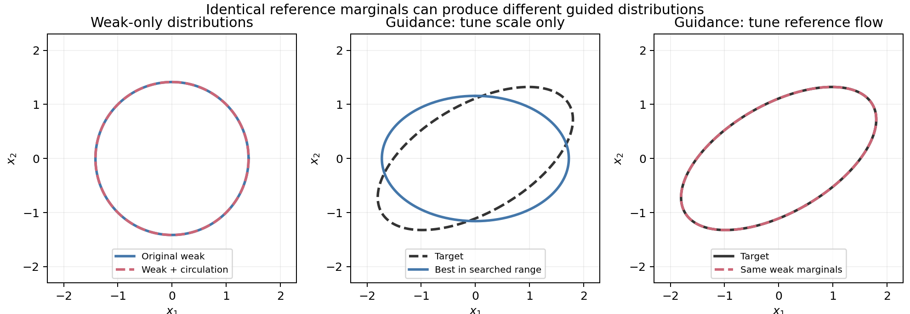

# 从学习弱分布，到学习可用于组合的参考动力学

2026-09-22。本笔记依据本地 Codex 对话、仓库实验报告、实现及原始论文。重点阅读“查找并实现 Self-Guidance”9 月 15–22 日的后半段，同时回看“梳理仓库研究轨迹”“验证 CFG 方向核心研究”“探索生成模型迭代稳定性”的相关往来。

本轮完成的是研究分析、文献查重与一个 CPU 精确 Gaussian 例证。没有更改现有训练流程，也没有启动新的 GPU 训练、采样或 FID 搜索。下面分别标明历史结果、解析结论与尚未验证的方法候选。

**后续理论修订：** [进一步推导与反例](SELF_GUIDANCE_DEEP_THEORY_20260922_ZH.md)已经完成。保 weak 运动存在密度比重排不变量，其效用需要未来动力学或状态系数激活；候选二等价于预条件梯度，在同一步长预算下可以任意差，因此撤回下文“实用主线优先候选二”的排序，将其降为优化对照。后续还证明当前 minibatch norm 锚点在消去可吸收尺度后仍保留样本能量方差惩罚。下文保留初轮论证，以便追踪哪些判断被修正。

**核心判断：最值得发展的不是“GAN 也可以训练弱头”这个组合，而是哪些参考动力学自由度对组合生成有价值，以及如何让弱头专门学习系数无法替代的修正。**

## 1. 当前研究到底推进到了哪里

思想演化中最重要的几步是：

1. 从 latent/decoder 局部配对误差，转向实际生成效果；局部更准并不保证递归生成更好。
2. 从现成的弱模型、SG 平滑、未来一致性，转向“弱模型究竟应该拟合什么”。
3. 从预设弱分布形状、三分布误差混合，转向由实际强弱组合的终点效用监督弱头。
4. 从固定弱头或固定系数，转向冻结强模型、联合训练 provider 与全程有符号系数。

当前实际模型为

\[
v_{\phi,a}=S+a(t)(S-W_\phi),
\qquad
G_{\phi,a}=\operatorname{Sampler}(v_{\phi,a}).
\]

GAN 区分真实 RGB 与实际组合采样后的最终 RGB。当前图像先经过冻结 Inception2048，再由可训练条件判别器判别；它不是直接约束完整像素密度。强模型冻结参数，但完整轨迹仍保留其输入 Jacobian。

最新的 SiT 使用 depth4 后接 1 个原生 Transformer block 的 50K EMA，联合训练该头和 64 个有符号系数，初始化全程 a=.75。JiT 使用 layer6 的 1-block 50K EMA，冻结强弱模型、训练 50 个有符号系数。两者的新一轮 GAN 质量结果尚未形成。[当前联合实验](SIT_JOINT_PROVIDER_SCALE_20260922_ZH.md)、[JiT 系数实验](JIT_BLOCK1_GAN_SCHEDULE_20260922_ZH.md)。

**已有收益的归因必须分开。**

| 已有实验 | 同协议结果 | 当前能支持的判断 |
|---|---|---|
| SiT 普通真实数据 FM，不做 GAN | fresh shallow / 1-block / 2-block 最佳前半程 FID-5K：36.8451 / 30.9767 / 29.0626 | 原生 Transformer 参考头值得研究；2-block 的最好点仍在扫描边界 |
| JiT 普通真实数据 FM，不加 CFG | 强模型31.6918；1/2-block参考引导16.3054/13.9338 | 在这个条件下参考头引导收益明显 |
| 旧 SiT MLP endpoint GAN | 36.688848 → 36.444090 | 同5K选参下的小幅增量，不能据此宣称稳定显著胜出 |
| 原生 SiT 头冻结，仅学时间系数 | 本轮初始化41.3450 → 38.8507 | 相对自身初始化有效，未超过历史更好头的结果 |
| 最新 SiT joint 初始化 | 同一1-block、全程a=.75：33.263440 | 这是当前joint的直接起点；不能将2-block的29.0626当作同架构基线 |

来源：[SiT容量结果](SIT_TRANSFORMER_CAPACITY_20260921_ZH.md)、[JiT容量结果](JIT_SSG_REAL_CAPACITY_20260920_ZH.md)、[原生signed schedule](NATIVE_IG_SIGNED_SCHEDULE_20260919_ZH.md)、[历史GAN](README.md)。

SiT 的 Transformer 对照同时改变了注意力、参数量、初始化与训练计算，尚未证明单独是 attention 导致改善。JiT 带 CFG 时的固定系数增量较小，不能用无 CFG 的大幅收益替代对强 CFG 基线的结果。

一个很有价值的矛盾是：增强 MLP 的 W-MSE、W-only FID 改善，guided FID 却没有跟着改善；原生 block 同时改善三者。并且真实插值点上的预测 MSE 最优系数略负，终点 FID 最优系数为正。[具体误差诊断](SIT_TRANSFORMER_CAPACITY_20260921_ZH.md)。

这说明应研究“参考如何改变终点”，不能继续用一个 W-MSE 排名替代参考的用途。但仅观察到这个冲突，还不能确定原因是概率流 gauge、离策略状态、数值误差或判别表征。

## 2. 哪些东西不能再次当成新 idea

对仓库查重后，以下内容已经有推导或实验：

- **有限头空间外的强模型残余被放大。** 固定线性函数空间 V 时，组合回归的最优场为 \(\Pi_Vv_P+(1+a)(I-\Pi_V)S\)，自由残差为 \(\Pi_Vv_P+(I-\Pi_V)S\)。[9月15日记录](../GUIDANCE_IDEA_REVIEW_20260915_ZH.md)。
- **去掉浅层可预测 gap。** 9月9日已经拟合过仿射项，并做过独立5K；FID约改善1.27%，成本上升，其他指标没有同步改善。[确认结果](../SMALL_SIT_PREDICTABLE_GAP_CONFIRMATION_RESULTS_20260909_ZH.md)。
- **加权无散误差、最小能量修正、终点可控性与 Gram 算子。** 9月6日已有理论及有限尝试。[可观测误差](../RAEV2_OBSERVABLE_ERROR_GUIDANCE_20260906_ZH.md)、[终点控制](../RAEV2_GUIDANCE_READING_ENDPOINT_CONTROL_20260906_ZH.md)。
- **分支自身无效的 gauge 经 guidance 混合可以有效。** 9月13日已经写过交叉项并检查删除 gauge 的路线。[旧推导](../research/identity_operator_20260913/last_round_constructive.md)。
- **终点反传、动态系数、尺度补偿、不是唯一弱分布、GAN后训练关系。** 9月19–22日已经充分讨论。[自由度](GUIDANCE_FREEDOM_20260919_ZH.md)、[尺度理论](DISCRIMINATOR_SCALE_THEORY_20260919_ZH.md)。

因此本笔记的候选新意必须落实到**不同的训练问题、可执行构造或具有预测能力的实验**，而不是再解释一遍这些公式。

外部最直接的边界也很清楚：

| 原始来源 | 已有贡献 | 对本研究的含义 |
|---|---|---|
| [SSG](https://arxiv.org/html/2607.29122v1) | 冻结pixel diffusion、中间参考头、自生成数据、容量比较 | 原生block参考头与冻结主干本身不能当新增贡献 |
| [GAS](https://arxiv.org/html/2510.17699v2) | 用终点对抗反馈与蒸馏学习采样器参数 | 终点GAN学习少量参数已有近邻 |
| [Adversarial Learning of CFG Schedules](https://arxiv.org/html/2608.14038v1) | 用中间边缘匹配学习时间、状态、条件相关scale | GAN学scale已有直接工作；其中间边缘目标与本轮终点目标不同 |
| [AdaGen](https://arxiv.org/html/2603.06993v1) | 冻结生成器、对抗奖励学习采样策略 | GAN换RL不能独立建立创新 |
| [Efficient Adjoint Matching](https://arxiv.org/html/2605.11480v1) | detached rollout与终点重新加噪，构造高效adjoint回归 | 终点反馈局部化已有方法，不能泛称新训练原理 |
| [PathGuide](https://arxiv.org/html/2608.29107v1) | on-policy transport目标与逐区间scalar CFG选择 | on-policy/transport/schedule三者的组合已有近邻 |

这些邻居不使当前研究失去价值，但要求贡献从“组合了哪些组件”转向“解决了什么以前没有处理的问题”。

## 3. 候选一：保持弱分布，学习更有用的参考概率流

**这是我认为最有突破潜力、同时落地风险最高的一条。**

用户目前的叙事是“不给弱分布规定形状，让它通过组合终点找到适合的分布”。可以更进一步问：

> 如果弱模型所有时刻的分布都完全不变，仅改变它搬运概率质量的方式，是否就能成为更好的参考？

这不是重新证明“终点分布不能识别整个模型”；仓库已经知道。新的任务是：**主动在保持 weak 边缘的等价类里训练 reference，让另一条组合采样过程变好。**

固定 weak 的实际边缘 \(q^W_t\)，构造

\[
\widetilde W_\eta=W+u_\eta,
\qquad
\nabla\cdot(q^W_tu_\eta)=0.
\]

在正则性、连续性方程唯一解及相同初始分布条件下，W和\(\widetilde W\)具有相同的全部时间边缘。然而组合变成

\[
\widetilde v=S+a(t)(S-W-u_\eta).
\]

对另一个光滑正密度q，有

\[
\nabla\cdot(q u_\eta)
=q\,u_\eta\cdot\nabla\log\frac{q}{q^W_t}.
\]

因此相对于 weak 无效的运动，相对于 guided 分布可能有效。激活条件不是简单的 \(q\ne q^W\)，还要求右侧不为零；两个同心径向分布配纯旋转就是可能无效的对照。

由此得到具体目标：

\[
\min_\eta L_{\rm end}\big(G_{S+a(S-W-u_\eta)}\big),
\quad\text{s.t.}\quad
\nabla\cdot(q^W_tu_\eta)=0.
\]

第一阶段固定S、W、a，只训练u；随后再与可训练a比较。目的不是让W本身更好或更坏，而是找出同一参考分布中**更适合参与组合的实现方式**。

相对于无限表达能力、任意可训练W的joint，这个约束是在缩小搜索空间，不是增加理论表达能力。因此不能声称它的全局最优必然优于自由joint。潜在价值是提供明确的机制干预，以及一种较少参数、保留reference边缘的归纳偏置；能否更容易学到有益修正，必须实测。

### 3.1 本轮已经得到的精确例证

从二维标准 Gaussian 开始，令

\[
S(x)=\begin{pmatrix}\log2&0\\0&0\end{pmatrix}x,
\qquad b=\frac{\log2}{2},
\qquad J=\begin{pmatrix}0&-1\\1&0\end{pmatrix},
\]

\[
W_\omega(x)=(bI+\omega J)x.
\]

因为 \(e^{\omega tJ}\) 为正交旋转，weak独立生成的全部边缘都为

\[
q^{W_\omega}_t=\mathcal N(0,e^{2bt}I),
\]

与 \(\omega\) 无关。

先固定目标为30度旋转的椭圆Gaussian：

\[
C_{\rm target}=R_{30^\circ}\operatorname{diag}(4,1)R_{30^\circ}^{T}
=\begin{pmatrix}3.25&1.2990381\\1.2990381&1.75\end{pmatrix}.
\]

当 \(\omega=0\) 时，无论a(t)怎样变化、是否取负，组合矩阵始终对角，无法产生目标非对角协方差；这个不可达结论不依赖系数扫描范围。

允许改变weak内部旋转后，常数

\[
a\approx0.21749745,\qquad\omega\approx-5.04035635
\]

就能匹配该目标。用矩阵指数计算连续流、以协方差最小二乘求两参数，本轮得到：

| 对照 | Gaussian总体 \(W_2^2\) |
|---|---:|
| 无旋转，a在[-.99,5]内优化 | 0.37041165 |
| 学习a与保weak边缘的旋转 | 约1.8e-15，舍入误差量级 |

101个时刻的weak协方差相等性数值误差最大约2.2e-13；解析式对全部时刻成立。这里的Wasserstein量是两个已知Gaussian之间的总体距离，**不是图像FID，也不是GAN训练结果**。目标在优化前固定，图中椭圆表示协方差轮廓。

[CPU可复现脚本](../../experiments/theory_self_guidance_20260922/gauge_reference_witness.py)、[数值原件](../research/self_guidance_breakthrough_20260922/gauge_reference_witness.json)、[PDF](../research/self_guidance_breakthrough_20260922/gauge_reference_witness.pdf)。

这个例子的意义是建立可利用自由度的存在性；Gaussian旋转本身不新，不证明图像模型采用这个机制，也不证明任意控制目标均可达。

### 3.2 高维构造与真正的难点

若已知weak实际边缘score，一种标准构造为

\[
u_\eta=\nabla\cdot A_\eta+A_\eta\nabla\log q^W_t,
\qquad A_\eta^T=-A_\eta.
\]

反对称性使 \(\nabla\cdot(q^Wu_\eta)=0\)。空间常数的低秩A无需计算矩阵divergence，可以从少量平面旋转开始。

**但当前W的预测不是其实际rollout边缘score的已知精确表示。** 直接把W按Tweedie公式转换，只在相应正确的FM/Bayes条件下成立；不能在任意误差场或GAN后训练场上据此宣称保持实际边缘。这是图像落地最需要解决的问题。

另一种严格构造使用weak流映射 \(\Phi_t\)：取随时间变化的正交 \(R_t\)、\(R_0=I\)，定义

\[
\widetilde\Phi_t(z)=\Phi_t(R_tz).
\]

因Gaussian prior旋转不变，这保留所有weak边缘。其场修正涉及 \(\Phi_t^{-1}\) 与 \(D\Phi_t\) 的JVP，通常很贵。**常数R只重标初始噪声，不改变Eulerian速度场，不能用来获得这里的guidance改变。**

优先的后续研究不是立刻套到RAEv2，而是在有精确density/flow的小型非Gaussian模型上，用固定a训练u，并对比随机u与训练u。之后才测试近似边缘保持的小头；近似版必须报告实际weak分布漂移，不能继续沿用精确保证。有限步Heun不精确保旋转范数，也必须与连续场保证分开。

### 3.3 与已有工作的精确区别

[Gauge freedom, ICLR 2024](https://arxiv.org/html/2402.03845v1)和[Diffusion Models Observe Only Gradients](https://arxiv.org/html/2606.06179v1)已有相应分解与误差几何。[EDDY](https://arxiv.org/html/2605.06553v1)提出保边缘粒子引导，其单分布反对称恒等式可用；特定 iid 构造的联合多样性论断需另行核对，见[后续审计](../research/self_guidance_breakthrough_20260922/weak_gauge_leakage_theory.md)。[NGIF](https://arxiv.org/html/2605.25107v1)在匹配population边缘的流中用正则选择代表元。

候选区别应限定为：**保留的是reference的边缘；优化的是另一个strong/reference组合生成器的终点质量。** 不是笼统“利用gauge”，也不是“主动学习非梯度流”。本轮检索未找到逐项对应的方法，但检索不能证明不存在先例。

如果高维代价无法控制或约束误差完全解释了质量增量，这条路就不能作为实用guidance方法成立。它仍可能提供机制结果，但不能靠Gaussian例子宣称图像突破。

## 4. 候选二：让provider学习scale无法替代的终点修正

**初轮判断认为这条更适合当前SiT joint；后续反例使其降为优化对照。** 下述一阶下降证明成立，但不提供相对普通联合更新的优势，也不增加可达方向。详见[修正推导](SELF_GUIDANCE_DEEP_THEORY_20260922_ZH.md)第7节。

当前锚点限制真实插值probe上的 \(\|S-W\|\)，能够抑制径向尺度漂移。但两种不同幅度/方向的场，经过后续生成过程后可能产生相同终点效应。真正应该分工的对象可以改成：**哪些provider更新在生成效果上只是在替代调scale？**

令Y为同一批噪声/类别经过实际求解器后得到的终点特征，所有样本堆叠；固定当前D、特征度量与参数，定义

\[
J_a=\partial_aY,\qquad J_W=\partial_\phi Y,
\qquad g=\nabla_Y L_{\rm end}.
\]

令 \(P_a=J_aJ_a^\dagger\) 为当前schedule可造成的局部终点变化的正交投影。关键区别是它通过**完整后续动力学**定义，不是当前latent中gap的余弦/范数。

希望让scale负责 \(P_ag\)，让provider负责剩余的 \((I-P_a)g\)。只把后一项反传给provider不够，因为 \(J_WJ_W^T\) 会把输出变化重新混回前一空间。

一个一阶自洽的更新为

\[
r=(I-P_a)g,\qquad
\delta\phi=-\eta J_W^Tr,
\]

\[
\delta a=-J_a^\dagger J_W\delta\phi-\eta_aJ_a^\dagger g.
\]

第一项补偿provider更新中可被scale吸收的效应，第二项执行scale自己的任务。因此

\[
\delta Y=-\eta(I-P_a)J_WJ_W^T(I-P_a)g-\eta_aP_ag,
\]

\[
g^T\delta Y=-\eta\|J_W^T(I-P_a)g\|^2-\eta_a\|P_ag\|^2\le0.
\]

这是固定D和线性化下的下降方向证明；不是有限步Adam/GAN收敛定理。

**这与给gap加norm penalty的差异是实质性的：**它不要求把weak输出幅度保持在某个初值附近，而是让provider用有限训练预算去增加“原先只靠scale做不到”的终点能力。它也没有改变终点目标，改变的是局部优化几何。

### 4.1 必须避开的错误

- 先对W做普通梯度步再补偿，未必下降。需要同时投影反馈与补偿实际效应；上式两者缺一不可。
- scale全批共享，不能逐样本各拟合一个a再声称这是当前时间schedule能实现的东西。
- 小奇异值可能产生巨大补偿。应截断SVD/使用可信步长；ridge得到的不是严格正交投影。
- 单批高参数头可能拟合所有终点方向，这不证明总体可控性。对W的可表达性研究要有预算/正则，并在保留噪声与类别上检验预测变化。
- 当前Inception看不见的方向仍可能漂移；特征空间补偿不等于RGB或latent处处保持。
- 当前sampler自定义反传主要支持一阶VJP，完整JVP/Gram计算不是已有免费的功能。可先在8–16个预先固定的schedule基方向上做近似，明确只处理这个子空间。

该方法接近[变量投影](https://epubs.siam.org/doi/abs/10.1137/0710036)、商空间优化与块优化；这些基础概念不是创新。原始变量投影利用可分离最小二乘结构，本处endpoint对a非线性，因此不能直接套用其全局消元结果。可能的新增内容是**将可被schedule吸收的provider更新在实际生成终点处分离，并证明它改善同预算训练或对头结构的判断**。

### 4.2 最小的决定性比较

使用同一个1-block初值、判别器、真实数据、求解器与训练预算，比较现有joint锚点方法与这个终点分工更新。需要有只学scale/只学W的同架构结果来判断联合收益来自哪里；不用原生FinalLayer与旧MLP的不同架构结果代替。

另外保留普通无锚点joint，避免把取消旧norm penalty的收益误认成新更新法的收益。上面的下降式只针对终点目标；若再加入参数空间正则或现有Adam动量，需要重新分析对应总更新。

在启动完整5K前，先验证有限小更新的预测终点变化与实际变化是否一致，以及补偿在另一批噪声上是否仍有效。这是检查候选的关键机制，不是重新写一套无关代理指标。

成功应表现为：在相同训练墙钟和部署成本下，终点质量改善更快或更大，而不只是gap ratio更接近1。失败条件包括：补偿很快失效、额外JVP成本抵消收益、或在当前强头中冗余根本不是主要瓶颈。

## 5. 两条辅助洞见：决定主线怎么推进

### 5.1 更强判别器不必然提供更多可用反馈

当前必须分开三件事：判别器能看到哪些错误；冻结生成器和小头能改变哪些方向；这些改变能否改善独立视觉质量。

梯度链为

\[
\nabla_\phi L=J_{\rm sampler}^TJ_{\rm decoder}^TJ_F^T\nabla_F L.
\]

若某种容易区分真假的图像差异位于冻结decoder/小头无法改变的方向，更强D会更准，但未必能使可训练部分改得更好。相反，若错误可修复但Inception遗漏了它，更换反馈表征才有直接价值。

因此，不以D准确率决定增强或减弱D。比较Inception与独立表征时，要同时看同预算小更新的实际终点改善和迁移质量。这可以解释一部分“D一直分得出来但模型不进步”，却不能事先断言当前瓶颈一定如此。

据可控性直接删掉critic目标会改变原分布匹配问题，所以“可控性感知D”目前还不是成熟新方法。它更适合作为判别当前瓶颈的研究问题。

### 5.2 现有signed曲线可能同时学习了生成控制与离散误差补偿

旧原生SiT学到11个负系数，范围[-1.1345,4.0459]，最大相邻跳变约2.968。曲线不平滑不能单独证明训练失败；有限步最优控制也可能不光滑。

但它提出一个尚未被同求解器5K回答的问题：**收益属于可迁移的向量场修正，还是特定Heun64实现的采样器适配？**

固定学到的物理时间曲线，将每个原区间细分为两个Heun步、保持区间系数相同，是较干净的首个对照。原始曲线与初始化都在两个网格上比较，观察相对收益。不能仅比较新网格上的绝对FID，也不能因一次换网格失效就断言所有方法无效。

若收益只在旧网格存在，可以如实研究采样器优化，GAS是强近邻；若收益能保留，再研究跨网格共享的provider与时间函数更有依据。这个对照会决定论文对象，但“随机步数训练”本身不够成为核心创新。

## 6. 加速可以帮助研究，但不应承担主创新

当前joint一次完整反馈昂贵，完整30K估计约75小时。源码的离散反传已经得到每个Heun场查询的cotangent b_j。[sampler.py](../../classifier_guidance/sampler.py)。

固定当前D与轨迹，缓存 \((x_j,h_j,S_j,b_j)\)，构造

\[
\widetilde L(\theta)=\sum_j\langle b_j,v_\theta(x_j)-v_{\theta_0}(x_j)\rangle+R_{\rm trust}.
\]

若trust项在初值梯度为零，\(\nabla\widetilde L(\theta_0)=\nabla L_{\rm end}(\theta_0)\)。未来依赖已经包含在b中，局部训练可复用冻结强特征，只重算小头。

这为“一次昂贵反馈、多次便宜拟合”提供明确起点。但多次更新后轨迹与cotangent陈旧，需要完整rollout刷新，并检查真实下降。它不是无偏替代，也不是可以永久省掉长反传。与[Adjoint Matching](https://arxiv.org/html/2409.08861v3)、[EAM](https://arxiv.org/html/2605.11480v1)的边界必须交代；当前具体优势若有，应来自保持原确定性求解器、复用早层计算及可靠的局部复用范围。

这条适合作为促成主方法充分实验的技术支撑，不能用实现提速代替生成机制与质量贡献。

## 7. 我建议怎样分配下一步研究

**本节为初轮排序，已经被后续理论修订。** 初轮建议“实用主线优先候选二，概念突破优先候选一”；现在候选二降为优化对照，优先研究保 reference 方向与状态幅度的作用限制，并检查现有 norm 的隐含偏置。完整新排序见[进一步理论](SELF_GUIDANCE_DEEP_THEORY_20260922_ZH.md)第9节。保留当前SiT joint/JiT schedule作为已经启动的基线，不因新分析中断它们。

候选二先回答“终点效应冗余是不是实际瓶颈”，并尝试能改善同预算训练的分工更新。候选一从固定weak边缘的非Gaussian精确模型开始，要求学习的circulation优于零/随机circulation，并能在相同a下改善组合；高维结构解决前不承诺图像低成本优势。

对图像质量继续沿用当前5K比较，不用1K排名推进新候选；将同一5K选参结果与独立质量结论区分。这里没有新启动评估或增加用户未要求的实验矩阵。

最有内容的潜在论文命题是：

> **一个参考模型的独立分布质量不足以刻画其引导价值；有效参考还取决于它在组合动力学中提供哪些可实现的终点改动。我们学习这些改动，而不只优化weak自身或其外推幅度。**

这不是现阶段已经得到的图像结论。支撑它需要保边缘参考实验，或终点分工方法的可重复优势；已有block容量收益与Gaussian例证不能替代这一步。
