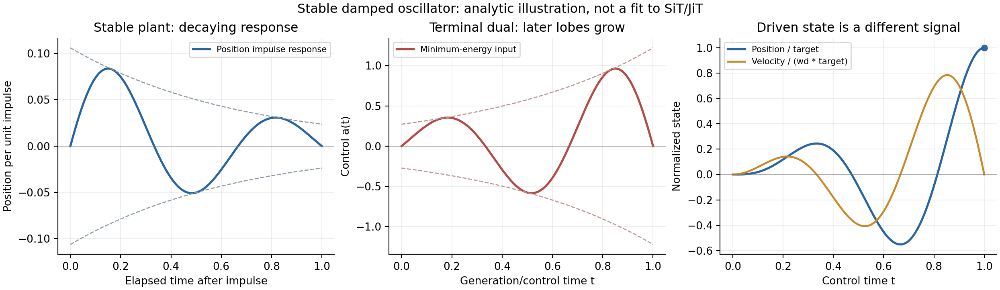

# “反着的二阶振荡”：伴随控制、输入整形与滑模的区别

2026-09-23。接续 [signed schedule 形状研究](SIGNED_SCHEDULE_SHAPE_THEORY_20260923_ZH.md)。用户提出“像二阶系统反着振荡”的类比。本轮将其具体化为可证明、可辨识的控制理论问题；仅做文献研究与 CPU 解析核验，没有修改图像训练。

**一个准确的对应是：稳定欠阻尼系统的终点最小能量输入，在正向时间上满足阻尼项反号的伴随方程。因此控制输入可以呈现朝终点增强的正负振荡，而受控系统自身依然稳定。**

这与滑模是不同的机制。现有 scale 图显示的是控制系数，尚未显示状态、误差或某个模态在振荡。必须先辨识响应，才能选择解释与控制器。

## 1. 四个“振荡”不能混为一谈

| 可能观察的对象 | 数学对象 | 说明 |
|---|---|---|
| 一次生成中的系数起伏 | \(a(t)\) | 当前图显示这个；它是施加的输入系数 |
| 一次生成中的状态/误差振荡 | \(q(X_t,t)\) 或其扰动 | 需选定有意义的观测量，不能由系数图直接断言 |
| 参数随训练迭代来回变化 | \(a^{(k)}(t)\) | GAN/优化器在训练时间上的动力学，横轴 \(k\) 不同 |
| 数值积分产生的振铃 | 连续场与离散 step map 的差异 | 需固定物理系数函数后加密网格辨认 |

“反着”也有两个容易混淆的含义。下面指终点目标诱导的伴随时间结构；它既不等于把生成过程倒放，也不能仅由“diffusion 本来是逆过程”推出。

## 2. 高维一阶 flow 可以包含二阶有效模态

冻结模型与参考系数，写

\[
\dot X=S(X,t)+a_{\rm ref}(t)B(X,t),\qquad B=S-W.
\]

对系数施加小变化 \(u(t)=\delta a(t)\)，状态扰动满足

\[
\dot \xi=A_t\xi+b_tu,\qquad
A_t=D_x(S+a_{\rm ref}B)(X_t,t),\quad b_t=B(X_t,t).
\tag{1}
\]

这是沿真实轨迹的时变线性化。若其某个可控、可观测二维子空间近似闭合，可能得到

\[
\ddot q+2\gamma\dot q+\omega_0^2q=u.
\tag{2}
\]

它本来就等价于两个一阶方程：

\[
\frac{d}{dt}\begin{pmatrix}q\\\dot q\end{pmatrix}
=
\underbrace{\begin{pmatrix}0&1\\-\omega_0^2&-2\gamma\end{pmatrix}}_A
\begin{pmatrix}q\\\dot q\end{pmatrix}
+\underbrace{\begin{pmatrix}0\\1\end{pmatrix}}_b u.
\]

所以“一阶生成 ODE”不排除二阶模态。但从高维系统投影到两个统计，通常会出现隐藏变量和记忆项，二阶闭合是要验证的假设。不能把整个生成模型宣布为机械振子。

还需注意，理想 canonical score/直线 flow 在固定时刻常具有对称输入 Jacobian，未必有复特征值。实际网络可能不是严格梯度场；时变矩阵也未必交换。观察到系数反号并不证明存在某对固定复特征值。

## 3. 稳定 plant 的输入为什么可以“反阻尼”

先研究准确的常系数系统 \(\dot z=Az+bu\)，从 \(z(0)=0\) 到 \(z(T)=d\)，选择最小输入能量：

\[
\min_u\frac12\int_0^T u(t)^2dt,\qquad
\int_0^T e^{A(T-t)}b\,u(t)dt=d.
\]

定义有限时间可控 Gramian

\[
W_T=\int_0^T e^{A(T-t)}bb^\top e^{A^\top(T-t)}dt.
\]

若 \((A,b)\) 可控，\(W_T\) 正定，唯一解为

\[
\boxed{u^*(t)=b^\top e^{A^\top(T-t)}W_T^{-1}d.}
\tag{3}
\]

这是经典最小能量控制；相关 data-driven 工作也直接研究如何从输入输出实验恢复这种控制，无需先恢复全部系统矩阵。[Baggio, Katewa & Pasqualetti, 2019](https://arxiv.org/abs/1902.02228)

对 Eq.(2) 的稳定欠阻尼模式，\(\gamma>0,\omega_0>\gamma\)，令 \(\omega_d=\sqrt{\omega_0^2-\gamma^2}\)。Eq.(3) 必有形式

\[
\boxed{
u^*(t)=e^{-\gamma(T-t)}
\{C\cos[\omega_d(T-t)]+D\sin[\omega_d(T-t)]\}.
}
\tag{4}
\]

常数 \(C,D\) 由目标和 horizon 决定。沿正向生成时间，其振荡包络按 \(e^{\gamma t}\) 增长。更准确地：

\[
\boxed{\ddot u^*-2\gamma\dot u^*+\omega_0^2u^*=0.}
\tag{5}
\]

对比状态方程中的 \(+2\gamma\dot q\)，输入的伴随方程中阻尼项反号。这就是“反着的有阻尼振荡”的严格数学对应。

这个结论并不要求输入一定是正—负—正。两次过零需要合适的相位与足够长的窗口，相邻零点间隔为 \(\pi/\omega_d\)。最后一段可以先达到正峰再下降；包络增大不等于实际信号单调增大。

图中取 \(T=1,\gamma=1.5,\omega_d=3\pi\)，要求从 \(z(0)=(0,0)\) 到 \(z(T)=(.02,0)\)。输入三个波瓣的峰值约为 .354、−.584、.962，最后回零；CPU 积分的终点误差约 \(8.9\times10^{-13}\)。这只是终点的位置和零速度约束，不保证停止施力后永久停在该位置。图没有拟合真实 JiT/SiT 曲线。

### 为什么这不是不稳定性证明

终点反馈沿伴随传播：

\[
p(t)=e^{A^\top(T-t)}p(T),\qquad \dot p=-A^\top p.
\]

当 \(A\) 稳定，从终点向过去增加剩余时间 \(\tau=T-t\)，该信号反而衰减。把同一函数按正向 \(t\) 画，才得到增长的包络。

这里是转置传播，不是逆状态传播 \(e^{-A(T-t)}\)。不能据此断言 BPTT 梯度爆炸、轨迹负阻尼或采样器不稳定。

## 4. 没有显式能量正则，为什么这个结构仍可能出现在训练中

当前 GAN 的 scale 训练没有 \(\int a^2\) 项。仍有一个相关的经典结构。

在固定线性系统中，记终点控制算子

\[
Ku=\int_0^T e^{A(T-t)}b\,u(t)dt.
\]

任意可微终点目标 \(L(Ku)\) 对输入的欧氏梯度均为

\[
\frac{\delta L}{\delta u(t)}
=b^\top e^{A^\top(T-t)}\,\nabla L(Ku).
\tag{6}
\]

因此所有梯度都处于 \(\operatorname{Range}(K^*)\)。若系统只有两个相关状态，该空间至多二维。在常系数欠阻尼例子中，每次梯度本身就是 Eq.(4) 的一种相位组合。

对 \(L=\frac12\|Ku-d\|^2\)，普通欧氏梯度流从 \(u_0\) 出发，在可控、可实现条件下收敛到

\[
u_\infty
=u_0+K^*(KK^*)^{-1}(d-Ku_0).
\tag{7}
\]

这选择最小 \(L^2\) 改变量；\(u_0\) 在 \(\ker K\) 中的成分保留。也就是说，**reference schedule 加伴随波形**不一定需要手工添加控制能量正则。

但当前 Adam 的逐 bin 预条件、moving discriminator、非线性与时变 field、样本间不同线性化都会破坏上述简单的固定二维结论。它解释的是一个可验证的局部近似。上一轮观测到少数时间梯度模态，只提供研究动机，尚未识别这些模态为二阶伴随。

## 5. 更一般的理解：时间系数是终点模态的滤波器

若局部 \(A\) 可对角化，取左特征向量 \(\ell_j^\top A=\lambda_j\ell_j^\top\)，有

\[
\delta z_j(T)
=(\ell_j^\top b)\,\mathcal F_u(\lambda_j),\qquad
\boxed{\mathcal F_u(\lambda)=\int_0^T e^{\lambda(T-t)}u(t)dt.}
\tag{8}
\]

同一条时间输入，相当于在不同模态上取不同的加权积分。可以选择增强一类终点作用、削弱另一类。它不要求每个时刻都沿所有统计的“好方向”推进。

对实 \(\lambda\)，只要 \(u\ge0\) 且在正测度上非零，\(\mathcal F_u(\lambda)>0\)。此时若要求某个被激发的实模态终点作用恰为零，就需要 signed 输入或改变其他控制条件。

因此正负交替并不一定意味着 plant 有振荡极点：多个非振荡模态之间的抵消也能产生正—负—正。

另一个相关的经典方法是 **input shaping（输入整形）**。它通过预先安排输入脉冲，抑制到终点时的残余模态；允许负脉冲能缩短某些整形器的持续时间，但通常需要管理参数误差和未建模模态。[原作者论文](https://www.researchgate.net/publication/2584317_Design_And_Implementation_Of_Time-Optimal_Negative_Input_Shapers)，[MIT 作者书目](https://web.mit.edu/shaping/www/singerpubs.html)

例如对无阻尼频率 \(\omega\)，三个输入整形脉冲

\[
(A_0,A_1,A_2)=(1,-1,1),\qquad
(t_0,t_1,t_2)=\left(0,\frac{\pi}{3\omega},\frac{2\pi}{3\omega}\right)
\]

满足

\[
\sum_i A_i=1,\qquad \sum_i A_i e^{-i\omega t_i}=0.
\tag{9}
\]

它保留 DC 增益，同时取消该振荡模态，长度为一个周期的 \(1/3\)。常见两个正脉冲 \((1/2,1/2)\) 的零振动整形器需间隔半个周期。这里是两个具体整形器的比较，不声称前者在所有约束下全局最优。

CPU 核验残差约 \(1.6\times10^{-16}\)。频率误差为 +10% 时，该负脉冲例子的残余幅度约 .187，说明在名义频率上准确抵消不等于鲁棒。

这种思路与我们的时间系数比喻很接近，但 diffusion 没有自动给定的“残余机械振动”。必须先定义要抑制的分布统计或特征响应。

## 6. 滑模究竟控制什么

滑模的出发点是一个有意义的误差与滑动面，目标是使状态到达并保持在该面上。

机械二阶系统常取误差 \(e\)，构造 \(s=\dot e+\lambda e\)。一旦 \(s=0\)，便有 \(\dot e=-\lambda e\)。切换控制用于到达并维持这个条件；它不是因为控制信号有几个正负段就成立。

对我们的一阶 control-affine 系统，应先选择一个确切的标量 \(s(x,t)\)，再计算

\[
\dot s=\underbrace{\partial_t s+\nabla s^\top S}_{f_s}
+a\,\underbrace{\nabla s^\top B}_{g_s}.
\tag{10}
\]

若 \(g_s\ne0\)，理想 reaching law \(\dot s=-\kappa s-\eta\operatorname{sign}s\) 对应

\[
\boxed{
a_{\rm SMC}
=-\frac{f_s+\kappa s+\eta\operatorname{sign}s}{g_s}.
}
\tag{11}
\]

在理想精确模型下，\(V=s^2/2\) 满足

\[
\dot V=-\kappa s^2-\eta|s|.
\]

有扰动时需明确扰动进入方式、界与控制方向；不能无条件继承鲁棒性。用 saturation/tanh 平滑切换可以缓和离散抖振，但一般会把严格到面收敛改成边界层性质。

### 该公式对本项目暴露了三个实质问题

1. **面是什么。** 强弱差值为零不等于生成分布正确；简单压低某个样本误差也可能损失分布覆盖。需要把质量、条件和分布目标联系起来。
2. **控制权是否足够。** 只有一个 scalar \(a\)，不能任意指定高维误差的每个分量。若 \(g_s\) 接近零，所需系数可能很大；这表示所选方向几乎不能推动该误差，并不是换一个控制器名称就能解决。
3. **反馈如何得到。** 当前系数是时间函数 \(a(t)\)，而 Eq.(11) 一般依赖样本状态。底层 \(B(X_t,t)\) 本身当然依赖状态，但 scale 尚未根据 \(s\) 反馈。计算 Lie derivative 也可能需要局部模型导数，不会自动变成零反传成本。

如果在一阶模型上直接定义 \(s=\dot e+\lambda e\)，且 \(\dot e\) 已包含 \(a\)，那么 \(s\) 自身也含 \(a\)，继续求导会出现 \(\dot a\)。这需要核对 relative degree 或引入动态扩展。它与真正二阶机械系统中“力首次进入 \(\ddot e\)”的结构不同。

## 7. 已有直接的滑模 CFG 论文

[CFG-Ctrl / SMC-CFG，2026 最新 v2](https://arxiv.org/html/2603.03281v2) 已把 conditional−unconditional discrepancy 用作误差信号，加入滑模切换修正，并报告图像实验。因此“把 CFG 看成控制/使用滑模”已有直接先例。

它的算法包含逐坐标的向量修正 \(-k\operatorname{sign}(s)\)，可以改变 guidance 方向；一般无法用本项目一个 \(a(t)(S-W)\) 表达。它的稳定性分析也有控制增益方向与漂移的假设，不能当作任意 learned field 的稳定性定理，更不能直接推出终点分布质量。

细节与受限 scalar-control 的核验见 [滑模适用性笔记](../research/self_guidance_schedule_shape_20260923/sliding_mode_relevance.md)。本轮不据理论条件的限制否定其报告的实证结果。

## 8. 适合本项目的下一步：先辨识，再设计控制

最有价值的第一步不是给曲线拟合一个阻尼正弦。这样容易得到漂亮拟合，却没有预测力。

建议在固定 checkpoint、固定采样器上进行少量成对小扰动：选择若干时间 bin，对额外系数施加 \(\pm\epsilon\)，使用相同 noise/label，测后续特征变化及终点统计。首轮可聚焦已知负谷和正峰附近。

这些响应应该区分三个假说：

| 假说 | 独立预测 |
|---|---|
| 一个近似稳定二阶模态决定波形 | 独立脉冲的衰减率/相位与控制梯度时间模式相容；能预测未参与拟合的脉冲组合 |
| 多个非振荡统计的作用被分离 | 终点响应核呈可抵消的不同时间结构，但不需要稳定的振荡频率 |
| 主要是离散求解器补偿 | 固定同一物理系数曲线后加密网格，收益或作用结构明显改变 |

辨识优先针对实际 Heun step map 的扰动响应，而非仅计算连续场在某点的两个特征值。非正规矩阵、时变性、样本差异和观测投影都会影响有限时间响应。

如果少数响应模态能够在独立样本与扰动上预测终点统计，可以构造

\[
a(t)=a_{\rm ref}(t)+\sum_{j=1}^r c_j\psi_j(t),
\]

用这些模态作低维控制基底，并通过小规模 rollout 反馈更新。复杂的图像动力学仍在，但优化对象可以变成少数可解释的时间作用。

若后续需要状态反馈，可在这个可辨识模型上做局部最优控制或 MPC；只有在找到了与目标相关、可到达且可测的滑动面之后，再讨论滑模的优势。低维控制或系统辨识均不会免费消除成本：它们用响应估计、预测误差与额外 rollout，交换完整长链反传的一部分代价。

还有一个可以定量决定“是否值得加反馈”的局部诊断。对分布矩 \(\mathbb E\phi(X_t)\)，记单个样本的即时响应 \(r(x,t)=\nabla\phi^\top B\)。共享 gain 的作用为 \(a(t)\mathbb E r\)，状态 gain 的作用为 \(\mathbb E[a(X,t)r(X,t)]\)。

若 \(\mathbb E r=0\) 但 \(\mathbb E r^2>0\)，共享 schedule 对该矩一阶失效；取与 \(r\) 同号的状态 gain 却仍可改变它。对系数能量 \(\mathbb E a^2/2\)，在非退化条件下，同样瞬时矩变化所需的两种最小能量之比为

\[
\frac{E_{\rm shared}}{E_{\rm feedback}}
=\frac{\mathbb E r^2}{(\mathbb E r)^2}.
\tag{12}
\]

这是简单的 Cauchy/最小二乘结论，不是新定理。它把“反馈也许有用”转为跨样本响应是否互相抵消的测量。系数能量依赖 \(B\) 的归一化；物理速度能量应改用 \(\mathbb E[a^2\|B\|^2]\)，相应加权推导见滑模笔记。一个矩的可控性也不等于整个目标分布已经可控。

## 9. 当前判断

“反着的二阶振荡”对应 **稳定状态动力学与其伴随控制输入之间的对偶**，这个对应有严格数学支持。它比只把曲线分成三个经验阶段更有解释力。

对于本项目，值得验证的研究主张是：少数终点可观测、可控制模态是否决定 learned schedule 的主要时间结构；负窗和末正峰是否在对这些模态进行选择与抵消。经典控制理论已经提供公式，新贡献需要来自真实模型的辨识、预测与收益。

复现材料：

- [二阶系统详细推导](../research/self_guidance_schedule_shape_20260923/second_order_control.md)
- [二阶系统 CPU 核验](../research/self_guidance_schedule_shape_20260923/second_order_control_audit.json)
- [二阶系统图 PDF](../research/self_guidance_schedule_shape_20260923/second_order_control.pdf)
- [滑模适用性与文献核验](../research/self_guidance_schedule_shape_20260923/sliding_mode_relevance.md)
- [输入整形 CPU 核验](../research/self_guidance_schedule_shape_20260923/input_shaping_audit.json)
- [输入整形脚本](../../experiments/theory_self_guidance_20260922/input_shaping_audit.py)
