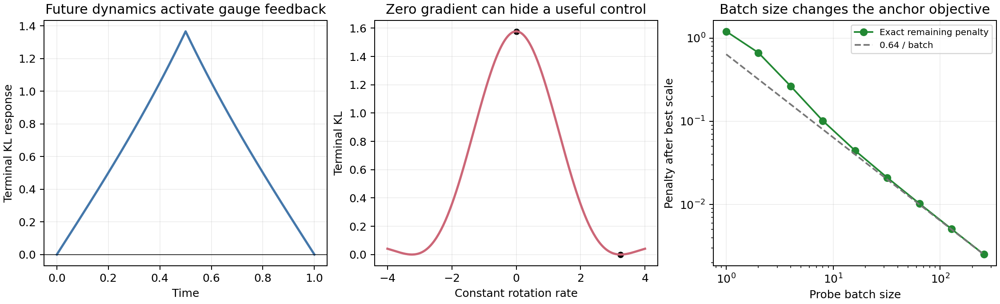

# Self-guidance 的进一步理论：不变量、可训练性与状态系数

2026-09-22 起草，9 月 23 日续审，接续[上一轮研究综合](RESEARCH_BREAKTHROUGH_SYNTHESIS_20260922_ZH.md)。本轮继续检查其两个候选的严格条件、反例和对当前实现的含义。新增内容包括解析推导、CPU 矩阵指数/积分核验及对 norm 锚点的源码审计；没有改动现有训练，也没有运行新的 GPU 采样或图像 FID。

**结论发生了实质修正。** “保 weak 分布的运动”值得继续研究，但不能单独改变任意分布误差；它需要与冻结动力学的相对压缩发生配合。状态系数能解除时间系数下的一部分不变量，是更具体的结构性问题。“终点效果分工”则只是一个预条件更新，应从突破主线降为优化对照。此外，当前 minibatch norm 锚点有可证明的样本能量偏置，并非纯粹固定一个不可辨识尺度。

## 1. 对象与假设

固定条件类别，省略条件记号。W 是冻结 reference 速度场，p_t 是 **W 实际 rollout 的边缘**，不是训练插值分布，也不预设为真实数据边缘。S 是冻结 strong 场。先令系数只依赖时间：

\[
\partial_t p+\nabla\cdot(pW)=0,\qquad
v_0=S+a(t)(S-W),\qquad v=v_0-a(t)u.
\]

假设修正满足加权无散条件

\[
\nabla\cdot(p_tu_t)=0.
\tag{1}
\]

于是 W+u 和 W 保持相同的全部边缘，但实际组合场 v 一般不同。记组合边缘为 q_t，密度比 r_t=q_t/p_t。

以下连续结论要求正且足够光滑的密度、相应可积性、无边界通量，以及流/连续性方程的适当唯一性；用到 L² 投影时另要求相关场属于该空间。有限步 Heun 不自动继承连续保分布性质。当前固定 Inception+判别器的 GAN 损失也不自动等于下面的全密度 f-divergence。

## 2. 第一条限制：纯 gauge 只能重排密度比，不能改变其值的分布

定义基底相对于 weak 的压缩率

\[
\sigma_t
=\frac{\partial_t p+\nabla\cdot(pv_0)}p
=\frac{\nabla\cdot[p(v_0-W)]}p
=(1+a)\frac{\nabla\cdot[p(S-W)]}p.
\tag{2}
\]

将 q=pr 代入组合连续性方程，利用 (1)，得到

\[
(\partial_t+v\cdot\nabla)r=-r\sigma.
\tag{3}
\]

沿实际组合轨迹 X_t，

\[
\log r_T(X_T)=\log r_0(X_0)-\int_0^T\sigma_t(X_t)\,dt.
\tag{4}
\]

**u 改变轨迹会经过哪里；r 沿粒子轨迹的增减率仍由固定的相对压缩场 σ 决定。** 若 σ 的空间上下界有限，(4) 给出与 u 大小无关的密度比振幅预算。任意大的旋转速度也不能突破这个预算。强模型误差如果在允许轨迹上没有可利用的压缩结构，就不能靠 circulation 自动解决。

对光滑凸 f，令 D_f(q‖p)=∫p f(r)、H_f(r)=rf'(r)−f(r)。分部积分得到

\[
\frac d{dt}D_f(q_t\Vert p_t)
=-\mathbb E_{p_t}[H_f(r_t)\sigma_t].
\tag{5}
\]

证明的关键是 ∂tp+div(pv)=pσ，因而
\[
\frac d{dt}\int pf(r)
=\int p\sigma f(r)-\int prf'(r)\sigma.
\]

u 在 (5) 中没有显式项，但它会改变未来 r 与 σ 的空间对应关系。不能因此说 u 对终点 divergence 没有作用，也不能反过来说“q≠p 就必然能产生有益作用”。

**纯 gauge 情形：v_0=W。** 此时 σ=0，所有 f-divergence 保持不变；更强的是 r_t 在 p_t 下的整个值分布保持不变。在 weak 的拉格朗日坐标下，运动是保持 p_0 测度的可逆重排。这与不可压缩输运的经典不变量一致，而不是一种新的任意密度校正器。

例如 p=N(0,I)，q=N(0,diag(4,1/4))。任意旋转可以改变 q 的方向，但 KL(q‖p)=1.125 始终不变。CPU 扫描的变化仅为 7.1e−15 舍入量级。

### 2.1 一个比“存在自由度”更强的可达性下界

在固定 reference 坐标下，目标写为 q*=p h。设 Q_r、Q_h 是 r、h 在 p 下的递增分位数函数。对无原子概率空间及适当有界正密度比，放宽到任意等值分布重排，可得

\[
\inf_{\widetilde r\sim_p r}D_f(p\widetilde r\Vert ph)
=\int_0^1 Q_h(s)\,
f\!\left(\frac{Q_r(s)}{Q_h(s)}\right)ds.
\tag{6}
\]

理由：代价 c(r,h)=h f(r/h) 的混合导数为 −r f''(r/h)/h²≤0，所以最优配对为同序配对。这是[经典次模重排结果](https://arxiv.org/html/1302.3280v2)在此问题中的应用。对 TV，对应下界是 ½∫|Q_r−Q_h|。

光滑可实现的保测度流只是上述放宽集合的子集，因此 (6) 对它是**乐观下界**，不是可达性保证。即使密度比值分布相同，等值集拓扑仍可能阻止精确匹配：二维 torus 上 1+εcos x 和 1+εcos 2x 的值分布相同，一般等值集的连通分支数却不同，不能被光滑可逆映射直接互换。

在固定 p 坐标中，若 b 是基底漂移、div_p b=σ、div_p u=0，且 [u,b]=(u·∇)b−(b·∇)u，则

\[
\operatorname{div}_p[u,b]=u\cdot\nabla\sigma.
\tag{7}
\]

这说明保测度运动与相对压缩的非交换性可以产生新的密度作用。但 bracket 非零不等于全局可控；不能假设冻结基底可以倒放，也不能忽略能量、时间和拓扑限制。

如果瞬间重排完全免费，则由 H_f'=rf''≥0，最有利的瞬时下降会把较大的 r 放到较大的 σ 处。这个排序方向对所有凸 f 一致。真实模型有有限控制速度和复杂几何，因此这只是解释最优控制所试图实现的结构。

## 3. 真正的激活条件：密度比与未来终点代价的相互作用

固定当前终点泛函的一阶变分 ℓ_T；对 GAN 可取固定当前 D 时的生成器终点损失。令 λ_t 满足

\[
\partial_t\lambda+v\cdot\nabla\lambda=0,\qquad\lambda_T=\ell_T.
\]

向 weak 加入 εu 的一阶终点变化为

\[
\delta J=-\int_0^T a(t)\mathbb E_{q_t}[\nabla\lambda_t\cdot u_t]dt.
\tag{8}
\]

令 P_sol^p 表示 L²(p) 中到加权无散子空间的正交投影，定义

\[
\eta_t=P_{\rm sol}^{p_t}(r_t\nabla\lambda_t).
\tag{9}
\]

在选定 L²(p) 控制能量、并加 β‖u‖²/2 的局部问题中，

\[
u_t^*=\frac{a(t)}\beta\eta_t,\qquad
\min\{\delta J_t+\tfrac\beta2\|u_t\|^2\}
=-\frac{a(t)^2}{2\beta}\|\eta_t\|^2.
\tag{10}
\]

这个投影公式本身属于标准 Hodge/最优控制工具。其具体判断力在于：

- r≠1 仍不足以使 η≠0。
- 因为 P_sol∇(rλ)=0，有 η=−P_sol(λ∇r)。若 λ=h(r)，则 η=0。
- 因而不是“参考与组合不同就可利用”，而是**其差异必须与未来终点代价形成可由无散运动改变的空间关系**。

若 q_0=p_0 且相关时间导数有界，则 η_t=O(t)。若终点目标恰好是 p_T 且 J=D_f(q_T‖p_T)，则 λ_T=f'(r_T)，所以 η_T=0，并在相同正则条件下 η_{T−h}=O(h)。局部最优能量收益因此在两端分别为 O(t²)、O(h²)。

这些端点退化条件**不证明中间只有一个峰，也不规定应该使用哪半程**。真实任务的目标数据通常不是 weak 终点；此时终点退化论证不能照搬。当前 learned signed schedule 的具体形状仍需要真实动力学证据。

一个两段不同方向线性压缩的 Gaussian 例子中，旋转的终点 KL 一阶响应在两端为零，内部最大绝对值为 1.3661。对四个时间位置积分脉冲，再直接计算扰动后矩阵指数，预测与有限差分相差约 1–2e−12。它核验的是未来动力学如何激活反馈，而不是为 SiT 的半程窗口提供证明。

## 4. 可表达与可训练不同：零梯度可以挡住一个完美控制

取 p=N(0,I)、W=0，固定非旋转控制后，组合场为

\[
v_\omega(x)=(B+\omega J)x,\quad
B=\begin{pmatrix}k&0\\0&-k\end{pmatrix},\quad
J=\begin{pmatrix}0&-1\\1&0\end{pmatrix},\quad T=1.
\]

Jx 保持 p。这里将原组合公式中的 −a 吸收到 ω；此例讨论固定基底下的旋转控制，不能用来宣称胜过同时允许任意变化的 a。

利用 (B+ωJ)²=(k²−ω²)I，

\[
\operatorname{KL}(q_1^\omega\Vert p)
=2k^2\left[
\frac{\sinh\sqrt{k^2-\omega^2}}{\sqrt{k^2-\omega^2}}
\right]^2,
\tag{11}
\]

当根号为虚数时取解析延拓。ω*=√(k²+π²) 给出 exp(B+ω*J)=−I，故终点精确恢复 p。但是

\[
J'(0)=0,\qquad
J''(0)=-\frac{4\sinh k\,(k\cosh k-\sinh k)}{k^2}<0.
\tag{12}
\]

不只是一个常数参数导数为零：沿 ω=0 轨迹，对任意时间局部线性旋转的一阶反馈都为零。原因是当时的 covariance C_t 与二次 costate 矩阵 K_t 都为对角，响应 tr(K_t J C_t)=0。一般线性旋转响应由二者的非交换部分控制。

因此该控制族里有完美解，而恰好从对称初值出发的一阶优化会停住。k=.8 时，初始 KL=1.57746、零点二阶导数≈−1.00934；ω*=3.24185 时 KL 约 4.9e−32。

**增加合适的状态依赖，可以让同一问题出现一阶下降方向。** 取

\[
u(x,y)=\big(x(y^2-1),\ y(1-x^2)\big).
\tag{13}
\]

直接计算 div u=y²−x²、(x,y)·u=y²−x²，故 div(pu)=0。虽然它是三次场，但半径平方的导数为 2(y²−x²)，受半径平方控制，不因三次项自动爆炸。

在同一基底 B 下，将场局部改为 v+εu，对目标 KL 的一阶响应为

\[
\mathbb E_{q_t}[\nabla\lambda_t\cdot u]
=2\{\sinh[2k(1-t)]+\sinh(2kt)-\sinh(2k)\}<0
\quad(0<t<1).
\tag{14}
\]

中点响应为 −1.19871。这个反例说明：“小头的梯度接近零”不必等于“它已修好了所有能修的问题”；增加结构可能改善局部可训练方向，而不是单纯增加全局表达范围。它支持区分容量与训练几何，**没有证明当前 Transformer 头的图像收益就是这个原因**。

## 5. 状态系数改变了密度作用方式，不只是增加 schedule 参数

前面的不变量依赖 a=a(t)。若 a=a(x,t)，即使 div(pu)=0，也有

\[
\operatorname{div}_p(-a u)=-u\cdot\nabla a.
\tag{15}
\]

故单独 gauge 项对 f-divergence 导数的贡献变为

\[
\left.\frac d{dt}D_f(q\Vert p)\right|_{-au}
=\mathbb E_p[H_f(r)\,u\cdot\nabla a].
\tag{16}
\]

对于 KL，该式为 E_q[u·∇a]。若 q=p，这个期望仍为零：divergence 在全局最小值处不会神奇地产生非零一阶下降。

完整场相对 weak 的压缩率为

\[
\sigma_{\rm full}
=(1+a)\operatorname{div}_p(S-W)
+(S-W-u)\cdot\nabla a.
\tag{17}
\]

所以状态系数也会改变原始 S−W 项；做机制归因时必须将这部分与 −u·∇a 分开。局部终点控制的投影相应变为 P_sol^p(a r∇λ)，通常不能把 a 移出投影。

### 5.1 所有时间 schedule 都无效，极小状态 gate 却改变密度的精确例子

令 p=N(0,I)、S=W=0、修改后的 weak 为 Jx。W 与 Jx 都保持 p。

- 对任意时间函数 a(t)，组合速度 −a(t)Jx 只是旋转，始终 q_t=p。
- 令 a(x,y)=βxy，则 v=(βxy²,−βx²y)，有

\[
\left.\partial_tq\right|_{q=p}=\beta p(x^2-y^2),\qquad
\left.\frac d{dt}\operatorname{Cov}(q_t)\right|_{0}
=\begin{pmatrix}2\beta&0\\0&-2\beta\end{pmatrix}.
\tag{18}
\]

这个 gate 使旋转在不同位置有不同速度，因而可以改变角向密度；它不再保持 p。每个粒子的半径却严格不变，仍不能纠正径向分布。此例证明新的密度方向被激活；若目标本身就是 p，该变化反而离开正确分布。

令 ρ²=x_0²+y_0²、z=exp(−βρ²t)，精确流为

\[
(x_t,y_t)=
\frac{\rho(x_0,z y_0)}{\sqrt{x_0^2+z^2y_0^2}},
\tag{19}
\]

原点固定。Gauss–Hermite 积分核验 (18) 到约 8.1e−10；βt=.2 时 covariance≈diag(1.35408,.64592)，trace 仍为 2。有限时间分布一般不是 Gaussian；例子使用可正可负且空间无界的 gate，不把这个精确解直接推广到受限 gate。

**值得发展的研究问题由此变得具体：** 保 reference 的方向场负责定义允许的运动路径，状态幅度沿这些路径创造可调密度压缩。这比“把 64 个 a 变成小网络”多了可证明的作用分解与失败条件。

但状态相关 CFG 已有直接文献，[Adversarial Learning of CFG Schedules](https://arxiv.org/html/2608.14038v1)就是近邻。新意不能是 a(x,t) 本身，而应是受约束 reference 方向与状态幅度之间的结构、可训练性、泄漏控制，以及同成本下的实际收益。无约束 joint 的函数族已经包含这些子族，约束不会凭空提高其全局最佳表达能力。

### 5.2 比单 gate 更强的结构：多个保分布方向可以解除共同不变量

下面固定 p 和若干满足 div(pu_k)=0 的光滑方向，研究

\[
v=-\sum_{k=1}^m a_k(x,t)u_k(x),\qquad D_k=u_k\cdot\nabla.
\]

在 q=p 处，瞬时密度方向为 ∂tq/p=ΣD_k a_k。L²(p) 下 D_k 形式反自伴；在完整保测度流生成元的适当闭算子域中，

\[
\overline{\operatorname{Ran}\{a\mapsto\sum_kD_ka_k\}}
=\left(\bigcap_k\ker D_k\right)^\perp.
\tag{19a}
\]

证明是分部积分后的 range/kernel 对偶。它给出比“多个头彼此正交”更有内容的互补标准：**它们是否共享了不能改变的样本属性。** 单个旋转的半径就是这样的不变量；单纯增加沿相同轨道的头无法解除它。单场也可能在其状态空间上遍历，不能无条件说一个方向必然不够。

若状态空间是连通紧致无边界流形，p 光滑严格正，u_k 光滑且其迭代 Lie brackets 处处张成切空间，则共同不变量只有常数。标准次椭圆结果保证

\[
\mathcal L=-\sum_k D_k^2
\]

能对任意光滑零均值 g 求唯一零均值光滑解 ψ。于是 a_k=−D_kψ 精确实现 g。只有共同核平凡而没有正则性条件时，(19a) 仅保证稠密范围，不保证稳定或光滑的精确解。

**在这些理想假设下还能构造有限时间输运。** 给定任意光滑正目标 q*=p h，令

\[
r_t=(1-t)+th,\qquad
\mathcal L\psi=h-1,\qquad
a_k(t,x)=-\frac{D_k\psi(x)}{r_t(x)}.
\tag{19b}
\]

因为 ΣD_k(r_ta_k)=h−1=∂tr_t，q_t=pr_t 精确满足连续性方程，t=1 到达 q*。紧致性和严格正性使 gate 光滑有界，流完整。这是经典[非完整 Moser 定理](https://arxiv.org/abs/0802.1551)在本记号下的构造，不是本轮发现的新定理；相关原文的 Theorem 2.1 与 Proposition 2.7 给出几何与 Poisson 求解基础。

一个明确的三维周期例：p 为 T³ 上均匀分布，

\[
u_1=\partial_x,\qquad
u_2=\cos x\,\partial_y+\sin x\,\partial_z.
\]

两个方向都保 p，且 [u_1,u_2]=−sin x∂y+cos x∂z，使三者处处张成三维。取事先固定目标 h=1+εsin z，|ε|<1，设

\[
b_1=\tfrac\epsilon2\sin(2x)\sin z,\quad
b_2=-2\epsilon\sin x\cos z,\quad
a_k=\frac{b_k}{1+t\epsilon\sin z}.
\tag{19c}
\]

直接计算 D_1b_1+D_2b_2=εsin z，故 q_t=p(1+tεsin z) 是精确解。任何仅随时间变化的这两个系数组合却都保持 p，不能到达 ε≠0 的目标。CPU 另以 32 条实际 ODE 特征线积分 log density；ε=.5 时，终点结果与解析密度的最大 log 误差为 6.75e−12，独立有限差分 divergence 核验误差为 3.47e−11。

这给出一个更值得检验的架构假设：**用少量共享 strong 特征、但运动方向互补的参考分量，配合状态幅度，可能比只增强一个参考分量的预测精度更有效。** 理论区分来自共同不变量和密度可控性，并非头数量本身。它不保证两个头在图像空间满足 bracket 条件，不保证小网络表示 (19b)，也不解决目标密度未知、控制代价或 GAN 可训练性。这里没有把经典可达性当作当前图像系统的训练保证。

## 6. 当前 norm 锚点：消去尺度后，仍惩罚样本能量波动

当前 [gap_anchor](../../classifier_guidance/sit_joint.py) 实际计算

\[
R_B(\phi)=
\left[\log\frac{\widehat E_{\phi,B}+\epsilon}
{\widehat E_{0,B}+\epsilon}\right]^2.
\tag{20}
\]

其中 E 是 probe 的 gap 平方在全部样本和空间维度上的平均；每次只用一个共同随机 t。当前有效 batch=32，但 norm probe 使用 microbatch=8，且 norm_weight=.1。probe 是独立真实 posterior 插值，并非组合轨迹。

忽略 ε，先做对“纯尺度固定”最有利的假设：整个 gap 可乘 k，a 可除以 k，组合场完全不变。设

\[
\zeta_B=\log(\widehat E_{\phi,B}/\widehat E_{0,B}).
\]

若 Eζ_B²<∞，则沿同一个组合函数的缩放轨道，

\[
R(k)=\mathbb E_B[(2\log|k|+\zeta_B)^2],\qquad
\boxed{\min_k R(k)=\operatorname{Var}_B(\zeta_B)}.
\tag{21}
\]

最优 2log|k|=−Eζ。**尺度完全吸收后，正则依然偏好某些修正函数。** 它偏好新旧 gap 在不同样本上的相对能量分布接近，而不只是固定一个总体 RMS。

如果允许任意 k(t)，余项为 E_t Var_B(ζ|t)；只有一个全局 k 时，还留下 Var_t E_B(ζ|t)。当前有限头族和分段系数未必能精确实现任意 k(t)，ε 也破坏精确缩放，因此 (21) 是理想可消尺度情形的分析，不是对当前参数空间等价性的断言。

更强的性质：固定 t、有限 iid probe batch、正能量及有限二阶矩条件下，最小正则为零，当且仅当每个样本的能量满足 e_φ(x)=c e_0(x) 几乎处处成立。证明：零方差使 Σe_φ=CΣe_0 几乎必然成立；独立性使 Σ(e_φ−Ce_0) 的零方差迫使每项为同一常数，再由其和为零知该常数为零。它限制的是样本能量，仍不限制 gap 方向。

对较大 iid batch n，条件于 t，并假设满足 L² delta method 所需的尾部控制（例如两种能量均被正数下界与有限上界统一约束），有

\[
\operatorname{Var}(\zeta_B)
=\frac1n\operatorname{Var}
\left(\frac{e_\phi}{\mu_\phi}-\frac{e_0}{\mu_0}\right)+o(n^{-1}),
\tag{22}
\]

其中新旧能量来自同一 probe 样本，必须保留两者协方差。相对能量的异质性可能是有用的，例如只有少数难样本需要大修正；当前 penalty 会对此产生额外偏好。是否实际伤害当前训练尚未得到证据。

精确二点例：e_0=1，e_φ 等概率为 1 或 9。对每个 batch 大小 n，分别优化一个跨所有 batch 共享的总体尺度，仍有：

| probe batch | 剩余最小 penalty |
|---:|---:|
| 1 | 1.206949 |
| 8 | 0.101585 |
| 32 | 0.021068 |
| ∞ | 0 |

这些数来自精确二项分布求和，不含蒙特卡洛选参。**改变 norm probe batch、保持 λ 不变，会改变隐含正则目标，不只是降低梯度噪声。** 这比泛泛说“norm 可能有偏置”更具体，也给当前代码一个可检验预测。

如果目的仅是调整数值尺度，可以研究每个求解器区间的共享正标量 m_i：

\[
v=S+\alpha_i\frac{S-W_\phi}{m_i},\qquad\alpha_i=a_i m_i.
\tag{23}
\]

这里 m_i 是模型持有的共享标量，在一次完整生成过程中固定。同一区间的所有样本及两次 Heun 查询必须共用 m_i；m_i>0、α_i 可任意有符号时，这与原函数族精确相同。更新 m_i 时相应更新 α_i，可以保持场不变。部署时改用新 batch 的即时 norm、却不精确补偿 α_i，会引入额外 batch 依赖，不能沿用等价结论。它无需额外输出 penalty，属于[weight normalization](https://arxiv.org/abs/1602.07868)一类参数化思路；不自动带来最优条件数或参数可辨识性。

逐样本除以自身 norm 则不同：时间系数不能吸收该变化，会消除原有的样本能量差异。m_i 是否参与求导、如何估计、如何同步 optimizer 状态也会影响优化。因此这里提出的是更干净的对照，未据此更改或否定正在运行的训练。

## 7. 修正上一轮：终点分工没有获得新的局部能力

记 A=∂_aY、B=∂_φY、P=AA†、Q=I−P、g=∇_Y L。上一轮提议

\[
\delta\phi=-\eta B^TQg,\qquad
\delta a=-A^\dagger B\delta\phi-\eta_aA^\dagger g.
\tag{24}
\]

它的一阶下降证明成立，但“可以下降”不足以说明比普通 joint 更好。若 A 满列秩，令

\[
T=\begin{pmatrix}I&-A^\dagger B\\0&I\end{pmatrix},\quad
D=\operatorname{diag}\{\eta_a(A^TA)^{-1},\eta I\}.
\]

则 (24) 就是

\[
\delta\theta=-TDT^T[A\ B]^Tg.
\tag{25}
\]

所以它是一个标准正定预条件梯度；没有增加局部可达方向，没有消除联合 Jacobian 的零空间，在正学习率下也没有改变普通 joint 的驻点条件。

**固定参数步长预算时，它可以任意差。** 取 A=εe_1、B=e_1、g=e_1，预算 δa²+δφ²≤1。两块都能改同一终点方向，(24) 却把 W 的反馈完全投掉，仅用效率 ε 的 scale。它最多产生 ε 的下降，普通联合预算最优下降为 √(1+ε²)，两者比值随 ε→0 趋零。

“两块方向重叠”也不意味着它们在一阶梯度流中互相抵消。普通 joint 满足

\[
\dot L=-\eta_a\|A^Tg\|^2-\eta_\phi\|B^Tg\|^2.
\tag{26}
\]

重叠可以提高当前状态的下降速度；是否损害有限步稳定性、泛化或墙钟效率需要单独研究。若 col A⊂col B，scale 只改变局部优化的速度和度量；否则它还会增加局部可达范围。

更合理的“分工”应考虑两块的真实更新代价。在线性化 Y、输出度量 M 和参数预算矩阵 R_a/R_φ 下，直接求联合正则二次问题，再用 Schur complement 消元，是已有的块优化方法。它可以作为对照，不能因为用到了 endpoint Jacobian 就当作新生成机制。

这个问题还有度量依赖：一般非等距终点特征坐标变换会改变原始 Euclidean 投影；必须让度量一起变换。若只把每张图的一个 critic logit 当作 Y，batch≤64 而 A 满行秩时 P=I，会人为抹掉所有 W 反馈，不能据此说弱头没有任务。

因此明确撤回上一轮“实用主线优先终点分工”的优先级。它仍可在预算正确的条件下研究优化效率，但目前没有理由让它承担突破命题。

## 8. 高维落地：近似保 weak 的误差必须纳入收益归因

[独立补充推导](../research/self_guidance_breakthrough_20260922/weak_gauge_leakage_theory.md)给出一个不依赖显式 score 的泄漏量：

\[
R_p(u)=\sup_{\mathbb E_p|\nabla\psi|^2\le1}
|\mathbb E_p[u\cdot\nabla\psi]|
=\|P_{\rm grad}^p u\|_{L^2(p)}.
\tag{27}
\]

在充分正则的 Hodge 分解、完整流和修改后场 Lipschitz 条件下，实际 reference 漂移满足

\[
W_2(p_T^u,p_T)
\le\int_0^T e^{\int_t^TL_sds}R_{p_t}(u_t)\,dt.
\tag{28}
\]

这不只是瞬间约束，但高维 Lipschitz 因子可能使上界很松。有限 test-network 测到的是 R 的**下界**，不能将“小观测残差”直接塞入 (28) 当证书。只检查均值/方差甚至可完全漏掉四阶矩的即时变化；补充文档给出有界 Lipschitz 的一维反例。

如果用反对称 A 与近似 score ŝ=s_p+e 构造 u=div A+Aŝ，则

\[
\operatorname{div}(pu)=\operatorname{div}(pAe),\qquad
R_p(u)\le\|Ae\|_{L^2(p)}.
\tag{29}
\]

空间常数低秩 A=BCBᵀ、Cᵀ=−C 只需估计 Bᵀs_p，可采用已有[投影 score matching](https://proceedings.mlr.press/v115/song20a.html)。但它是给定正交补坐标的条件 score，一般需要输入完整 x；低维边缘 score 并不能保住原来的高维依赖关系。

即使 weak 泄漏很小，guided 收益也可能由它主导。写 u=h+u_leak，其中 h 为精确 gauge，则局部终点收益中泄漏部分满足

\[
|\delta J_{\rm leak}|
\le\int |a(t)|
\sqrt{\mathbb E_{p_t}[r_t^2|\nabla\lambda_t|^2]}\,
R_{p_t}(u_t)\,dt.
\tag{30}
\]

密度比大时会放大小泄漏。因此“weak FID 不变、guided FID 改善”仍不足以证明保边缘机制；有限 critic 无法给出有效上界时应如实称为近似约束实验。

另一个统计陷阱是直接平方 minibatch 弱约束：E[(mean g)²]=(Eg)²+Var(g)/n，会连合法 gauge 一起惩罚。可以使用对偶 saddle 期望、独立 batch 乘积或 U-statistic 去掉这项偏置；这些也是标准工具，有限 critic 盲点不会因此消失。

## 9. 研究命题现在应该如何收窄

有充分理由继续研究的核心不是“GAN 训练 W 与 a”，而是以下三个相互区分的问题：

1. **保 reference 的方向自由度何时有用？** 通过 r、未来 costate 与 σ 的相互作用预测有效/无效；构造保边缘且目标预先固定的对照，区分重排收益与泄漏收益。
2. **哪些方向组合与小型状态幅度能解除时间系数的作用限制？** 用 (15)–(19c) 建立明确机制；多个方向的共同不变量比逐点正交更关键。再检查其代价、与普通状态 CFG 的区别，以及有限神经参数化是否足够。
3. **当前小头是否缺少可训练方向，还是受目标隐含偏置限制？** 用零一阶反馈反例区分表达与优化，并用 (21) 检查 norm 对样本能量结构的选择。

第二项是本轮比上一轮更具体的结构候选，但不是已证的图像方法创新。第一项的数学机制有大量前史；第三项中 norm 偏置最直接关联当前代码。终点分工退为优化比较；推理提速可支持验证，但不能代替生成机制。

最低限度的理论证据链应包含：一个不变量/不可达结论，一个解除它的最小结构，一个可训练而不只是存在的控制，以及约束误差无法解释全部收益的归因。随后才是同预算真实图像验证。这些要求用于选择最有信息量的研究，并非在本轮擅自启动新的实验矩阵。

## 10. 文献边界与复现

- [Gauge freedom, ICLR 2024](https://arxiv.org/html/2402.03845v1) 已有加权无散自由度；[NGIF](https://arxiv.org/html/2605.25107v1)已有基于样本弱约束与 gauge 选择的直接近邻。本笔记不将这些组件宣称为原创。
- [非可逆 Langevin](https://arxiv.org/abs/1506.04934)与[不可压缩混合综述](https://www.math.cmu.edu/cna/Publications/publications2023/papers/23-CNA-010.pdf)说明“保持分布的运动可以服务另一个目标”有很长历史。这里的具体对象是有限时间 strong/reference 组合终点。
- (6) 是经典重排结果的应用，(9) 是标准投影，(25) 是标准预条件化。潜在贡献应落在结构、限制、可训练方法及其实际证据上；检索不构成不存在先例的证明。
- [EDDY](https://arxiv.org/html/2605.06553v1)的单分布反对称恒等式可用；其特定 iid 粒子构造的联合多样性论断存在需要另行核对的条件，见补充文档。本推导不依赖该联合论断。

图左：未来动力学激活旋转的终点反馈；中：零梯度初值与有限控制的完美解共存；右：消去最佳尺度后的 norm penalty 随 probe batch 改变。均为解析可检查的低维问题，不是图像质量结果。

[CPU 脚本](../../experiments/theory_self_guidance_20260922/deep_theory_audit.py)；[完整数值](../research/self_guidance_breakthrough_20260922/deep_theory_audit.json)；[PDF](../research/self_guidance_breakthrough_20260922/deep_theory_audit.pdf)；[未来反馈 CSV](../research/self_guidance_breakthrough_20260922/future_gauge_response.csv)；[非线性反馈 CSV](../research/self_guidance_breakthrough_20260922/nonlinear_gauge_response.csv)。

复现命令：

    /home/zhoushunyu/miniconda3/envs/myenv/bin/python experiments/theory_self_guidance_20260922/deep_theory_audit.py

脚本包含精确线性流、独立扰动的有限差分、Gauss–Hermite 矩积分、精确二项分布求和，以及周期密度输运的 ODE 特征线交叉检查。上述结论尚未给当前 SiT/JiT GAN 的新一轮图像质量提供结果，也没有改变其运行状态。
