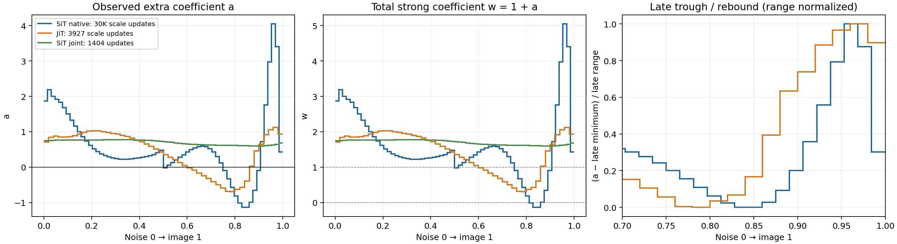

# 从“正—负—正”系数曲线辨识生成动力学

2026-09-23。接续 [局部响应与概率流](LOCAL_RESPONSE_AND_FLUX_THEORY_20260923_ZH.md)。本轮读取训练日志、重绘固定快照、推导解析模型、核验 CPU 例子并检索原始论文；没有修改训练或启动 GPU 实验。

**最值得追的假说：不同时间的同一个 strong−weak 方向，经过剩余生成动力学后，对终点统计的作用方向不同。带符号的 schedule 可以把希望保留的终点作用叠加，同时抵消不希望的作用。末端系数很大则需要另行辨认：它可能对应真正强控制，也可能只是在补偿差值方向变小，或补偿离散求解器。**

这个假说有严格成立的解析例子，也有能排除它的实验。不能仅凭曲线相似就把机制认定为“先收缩、再扩散、再修复”，更不能把该形状认定为 CFG 的普适最优解。

## 1. 实测：共同结构存在，但需要准确读图

时间统一为噪声 \(t=0\) 到图像 \(t=1\)。这里画的额外系数是 \(a\)：

\[
v_a=S+a(S-W)=(1+a)S-aW.
\]

常见以 weak 为基底的总系数是 \(w=1+a\)。JiT 的 \(S,W\) 在此式中指实际 velocity，须将 clean prediction 经分母换算。

| 固定快照 | 系数更新数 | 负谷 \(a_{\min}\) | 负谷位置 | 后段正峰 | 正峰位置 | 最后一格 |
|---|---:|---:|---:|---:|---:|---:|
| SiT native，冻结 depth-4 weak | 30,000 | −1.13449 | 0.85156 | 4.04591 | 0.96094 | 0.43128 |
| JiT，冻结单 block weak | 3,927 | −0.69144 | 0.79000 | 1.12261 | 0.97000 | 0.93772 |
| 新 SiT joint，weak 与 scale 联训 | 1,404 | 0.59911 | 0.89844 | 尚无相应负谷 | — | 0.68039 |

SiT native 为已完成的 20260919 实验。JiT 与新 SiT joint 是本轮读取时的固定快照；原始记录时间分别为 UTC 2026-09-22 17:17:28 附近，不声称是报告阅读时的最新状态。完整数值、日志位置、训练历史见 [schedule_snapshot.json](../research/self_guidance_schedule_shape_20260923/schedule_snapshot.json)。

几个影响解释的事实：

- JiT 的主负窗为 \(t\in[.60,.86)\)，SiT native 为 \([.75,.90625)\)。共同结构更准确是“前段正、后段负谷、接近终点处强正峰”；两者最后一格又下降。
- JiT 最深处是 \(0.309S+0.691W\)，仍为强弱模型之间插值。SiT 最深处是 \(-0.134S+1.134W\)，已经越过 weak。负 \(a\) 不等于倒着积分，也不自动意味着提高多样性。
- SiT native 64 步全 Heun，直接预测 velocity；JiT 是 49 步 Heun 加最后 Euler，且 velocity 分母为 \(\max(1-t,.05)\)。JiT 的 floor 或最后 Euler 可以影响其尾部，却不能单独解释两组的共同结构。
- 整体曲线不是同一个函数。按时间插值后的相关系数约 .577；只看 \(t>.7\) 约 .800。这是描述性统计，且两组训练长度、初始化和模型设置不同。
- 新 SiT joint 尚未出现负值，不能把冻结 weak 的结论直接当作 joint 训练已复现。

现有 SiT native FID5K 的整条曲线比较为 41.345 → 38.851；它支持整条 learned schedule 有收益，尚不能把收益归因于负窗或末端正峰。JiT 本轮没有核验到对应的 GAN schedule FID 结论。

原始时间积分也不符合简单的抵消故事：SiT 与 JiT 的 \(\int a\,dt\) 分别约 .576、.437，均非零。两者负面积恰好都约 −.106，但差值场、步长和模型不同，raw 面积不是守恒量，不能把这种接近当作定律。

## 2. 真正决定符号的是“到终点的作用”，而非局部强弱

固定 checkpoint，记 \(B=S-W\)，沿当前轨迹定义

\[
k_z(t)=D_x\Phi_{t,1}(X_t(z))\,B(X_t(z),t).
\tag{1}
\]

\(\Phi_{t,1}\) 是剩余生成 flow。\(k_z(t)\) 的含义是：现在沿 strong−weak 方向轻推一下，最终图像会向哪里变化。

一阶终点变化为

\[
\delta X_1(z)=\int_0^1 k_z(t)\,\delta a(t)\,dt.
\tag{2}
\]

因此，不同时间的正 \(a\) 不一定产生同向终点作用。若中段的 \(k_z(t)\) 转向，让 \(a\) 变负，反而可能使它与前后两段共同推动同一个终点目标。

固定当前判别器、令收益为 \(R(X_1)\)，控制梯度为

\[
\frac{\delta J}{\delta a(t)}
=\mathbb E[\nabla R(X_1)\cdot k_z(t)]
=\mathbb E[p_t\cdot B_t].
\tag{3}
\]

**这个梯度不是学好的系数 \(a(t)\)。** 当前训练没有系数 box 约束，也没有显式 \(\int a^2\) 代价；不能根据系数符号推断当前梯度符号，也不能直接套 bang-bang 最优控制。带能量代价或有界 Hamiltonian 的结论各有额外条件。[经典 switching-function 条件](https://liberzon.csl.illinois.edu/teaching/cvoc/node87.html)

对任意终点统计 \(F\)，应进一步看

\[
K_F(t)=\mathbb E[\nabla F(X_1)\cdot k_z(t)].
\tag{4}
\]

粒子位移不等于分布改变：保分布旋转也可产生很大的 \(k_z\)。足够丰富的终点统计或密度响应才与分布目标对应。一个判别器只观察其中一部分。

## 3. 一个严格的正—负—正最优解

令二维系统

\[
J=\begin{pmatrix}0&-1\\1&0\end{pmatrix},\qquad
S(x)=2\pi Jx,\quad B=e_1,\quad W=S-e_1,
\quad X_0\sim N(0,I).
\]

strong 在单位时间内转一整圈。strong、weak 各自的终点都为 \(N(0,I)\)，任何常数 guidance 的终点也都为 \(N(0,I)\)。

时变 guidance 的终点均值却是

\[
\mu_1=\int_0^1
\begin{pmatrix}\cos 2\pi t\\-\sin 2\pi t\end{pmatrix}
a(t)\,dt,\qquad \operatorname{Cov}(X_1)=I.
\]

以 \(N(me_1,I)\) 为目标，优化准确终点 KL 加控制能量：

\[
\min_a\frac12\|\mu_1-me_1\|^2
+\frac{\lambda}{2}\int_0^1a(t)^2dt.
\]

\(\lambda>0\) 时唯一最优解为

\[
\boxed{a^*(t)=\frac{m}{\lambda+1/2}\cos(2\pi t).}
\tag{5}
\]

这就是严格的“正—负—正”，没有网络误差、判别器误差或求解器误差。其原因只是不同时间的控制方向到达终点时转了方向，符号选择将其作用对齐。

它还说明：单步只有一个 scalar action，不意味着整段轨迹只能控制一个终点方向。时间变化和后续动力学可以提供更大的终点控制空间。weak 单独生成的质量不足以刻画它作为控制方向的价值。

这个构造是经典线性控制的应用，是机制存在性证明，不是当前实验的机制识别，也不解释真实曲线的不对称和尖锐程度。当前 GAN 没有上述能量正则。CPU 核验 \(m=1,\lambda=.25\) 得 \(a(0),a(.5),a(1)=(4/3,-4/3,4/3)\)，驻点残差约 \(1.7\times10^{-15}\)。

## 4. 更接近图像任务的解释：正负段分离不同终点统计的作用

在一个固定参考 schedule 附近，令 \(h(t)=\delta a(t)\)。假设希望提升某个终点统计，其响应核为 \(f(t)\)；同时希望另一统计不变，其响应核为 \(g(t)>0\)。例如前者是某种质量统计，后者是假说中的过度收缩；两者都必须测量，不能仅凭命名确定。

考虑局部最小能量问题

\[
\min_h\frac12\int r(t)h(t)^2dt,\quad
\int f h=m>0,\quad \int g h=0,\quad r(t)>0.
\]

在相关积分有限、\(f,g\) 不共线时，令

\[
\beta=\frac{\int fg/r}{\int g^2/r},\qquad
f_\perp=f-\beta g.
\]

其唯一解为

\[
\boxed{h^*(t)=
\frac{m}{\int f_\perp^2/r}\,
\frac{f(t)-\beta g(t)}{r(t)}.}
\tag{6}
\]

这个公式给出很清晰的可检验条件：

- \(g>0\) 且 \(\int gh=0\) 意味着非零控制必须含正负两部分；signed control 可以抵消一个不可避免的副作用。
- 符号取决于 \(f/g-\beta\)，即每单位副作用换来的目标收益，而不只是 \(f\) 的大小。
- 若 \(f/g\) 严格单调且权重满支撑，恰有一次符号转换。若连续且先严格下降再严格上升，并且两端都高于阈值 \(\beta\)，则为正—负—正；仅仅“单谷”不充分。

“负谷之后再正”因此给理论施加了额外约束：一个单调变化的质量—收缩权衡通常不够，至少要有非单调的相对响应、更多终点统计或非局部效应。

这里的 \(h\) 是局部改变量；只有以 \(a=0\) 为参考时才能直接把它看成系数本身。若 \(g\) 变号，或当前问题没有对应约束，必须重做论证。当前 GAN 也没有显式解这个二次问题。它的用途是提出可测的机制，而不是替现有训练补上不存在的目标。

还有一个与“大正峰、深负谷”直接有关的推论。记加权内积为 \(\langle f,g\rangle=\int fg/r\)，对应归一化相关为 \(\rho\)。最小控制能量为

\[
E_{\min}=\frac{m^2}{2\|f\|^2(1-\rho^2)}.
\tag{6a}
\]

与只要求目标收益相比，保持第二个统计不变会把所需能量放大 \(1/(1-\rho^2)\)。当两种统计的时间响应几乎共线，分离它们就需要强烈的正负抵消。

一个透明的例子是 \(r=g=1,\ f=1+\epsilon\cos(2\pi t)\)，其中 \(0<\epsilon<1\)。两个核处处为正，但最优解为

\[
\boxed{h^*(t)=\frac{2m}{\epsilon}\cos(2\pi t),\qquad
E_{\min}=\frac{m^2}{\epsilon^2}.}
\tag{6b}
\]

每个时刻单独的正控制都提高两个统计，组合后的正负控制却能保持一个不变、提升另一个。它严格为正—负—正，且两种响应越相似，所需正负幅度越大。

若这是局部图像模型的近似，幅度增大最终会超出线性化有效范围，因此不能把 \(\epsilon\to0\) 的公式当作无限增大真实系数的建议。该模型提出的是另一个机制：**大系数可能来自分离两个近乎相同的终点响应所需的代价，而不只是控制方向幅度太小。**

## 5. 时间形状何时具有独立作用：一个恒等式和一个边界

采用 \([F,G]=D G\,F-D F\,G\) 的约定，有

\[
\frac{d}{dt}\mathbb E[p_t\cdot B_t]
=\mathbb E[p_t\cdot(\partial_tB+[S,B])].
\tag{7}
\]

因为 \(a\) 仅依赖时间，\([aB,B]=0\)。式中没有显式 \(a\) 项，但轨迹和伴随仍依赖整条控制，不能说控制与该式无关。

若 \(\partial_tB+[S,B]=0\)，在 strong 的随流坐标中 \(B\) 变成同一个固定场；在解存在唯一的条件下，终点只取决于 \(\int a\,dt\)。这时同面积 schedule 逐粒子的准确连续终点相同，正负交替不能凭空产生新能力。

反过来，三个小脉冲若面积为 \(\varepsilon(1,-2,1)\)，中心在 \(t_0-h,t_0,t_0+h\)，则一阶终点作用为

\[
\delta X_1
=\varepsilon[k(t_0-h)-2k(t_0)+k(t_0+h)]
=\varepsilon h^2k''(t_0)+O(\varepsilon h^4).
\tag{8}
\]

完整非线性响应另有 \(O(\varepsilon^2)\)，有限脉宽另有近似误差。在 autonomous 场、参考 \(a=0\) 时，

\[
k''=D\Phi_{t,1}[S,[S,B]].
\]

三段控制可以抵消低阶共同作用，留下随时间弯曲的响应。这是二阶差分、非交换流和经典可控性的同一个结构。实际曲线不满足这些脉冲面积约束，不能仅凭外形就断言已观察到该机制。

## 6. 末端系数很高：先区分“坐标变大”与“作用变大”

真正加入速度场的是 \(u=aB\)。应至少比较

\[
\operatorname{RMS}(B),\qquad |a|\operatorname{RMS}(B),
\qquad c_i=D_{a_i}F_i,\qquad D\Phi_{i+1,N}c_i.
\tag{9}
\]

后两个分别是实际一步采样器和最终输出对系数的响应。即使 \(aB\) 大，也未必对目标分布影响大。

当前 Heun 的同一个 \(a_i\) 用在两个 stage。令 \(y=x+h v_a(x,t)\)，则

\[
c_i=\frac h2\{B(x,t)+B(y,t+h)
+hD_xv_a(y,t+h)B(x,t)\}.
\tag{10}
\]

不能把它无条件替换成 \(hB\)。JiT 应先将 clean gap 除以 \(\max(1-t,.05)\)，再和 SiT 的 velocity gap 作同类比较。

对标准直线插值 \(Y_t=(1-t)Z+tX\)、\(Z\sim N(0,I)\)，准确 CFG 场满足

\[
v_c-v_u=\frac{1-t}{t}\nabla\log\frac{\rho_{c,t}}{\rho_{u,t}}.
\tag{11}
\]

若终点密度平滑为正、所考察区域 score 差有界，则 \(B=O(1-t)\)。此时 \(a\sim1/(1-t)\) 可对应有限的实际控制。它解释了“系数为什么可能很大”，没有解释正号为什么最优。

若把有限终点作用集中到长度为 \(h\) 的最后一个 cell，而单位系数作用为 \(O(h^2)\)，系数甚至可能按 \(h^{-2}\) 放大。这是特定集中控制假设下的尺度关系，不是对当前曲线的预测。

这些条件不能直接套给任意 internal \(S-W\)、奇异数据流形或误差主导的网络。若两个 internal 模型都准确逼近同一 canonical field，差值应在所有时刻趋零；其实际控制价值来自模型差异，不能用 cond/uncond 的密度比解释替代。

本轮未运行 GPU 测量旧 SiT/JiT 的实际 gap 曲线。因此目前不能判定它们的尾部属于方向退化补偿。

## 7. 不能略过共同的 Heun：纯数值效应也能产生三相控制收益

取标量 \(x'=a(t)x\)，三个等长区间设 \(a=(A,-2A,A)\)。准确连续终点为 \(x_1=x_0\)。

每个区间只做一步 Heun，令 \(z=A/3\)，却有

\[
\frac{x_1^{\rm Heun}}{x_0}
=(1+z+z^2/2)^2(1-2z+2z^2)
=1+z^3+\frac94z^4+\frac32z^5+\frac12z^6.
\tag{12}
\]

\(A=1.5\) 时倍率为 1.3203125。同一物理控制在连续极限中无作用，在粗网格上却让输出扩张约 32%。

保持原三段函数，仅细分每段，3、24、96、384 步的倍率误差分别约 .3203、.002242、.0001264、.000007697，趋于零。

这与第 3 节形成一对机制相反的严格例子。两者都能出现正—负—正，单看系数图无法区分。离散补偿本身也可以有部署价值，只是对应的理论对象是实际采样器。

## 8. CFG：负段已经有先例，但三相共同机制仍需识别

截至本轮核验：

| 原始论文 | 与观察的关系 | 不能推出什么 |
|---|---|---|
| [Emergence of Distortions，2026-05 v4](https://arxiv.org/html/2602.00716v4) | 提出负 guidance window；SD1.5 实验先正、后切额外系数 \(a=-1\)，可改善 feature diversity 并保持一定条件分离 | 没有末端再正；未研究 \(a<-1\)；最强多样性仍伴随 prompt alignment 权衡 |
| [Adversarial Learning of CFG Schedules，2026-08](https://arxiv.org/html/2608.14038v1) | GAN 学动态 CFG，是直接近邻 | Eq.6 采用额外系数，但 softplus 强制其为正，不能表达本实验负谷 |
| [Applying Guidance in a Limited Interval，2024](https://arxiv.org/html/2404.07724v2) | 其设置中限制在中段有益，早期 guidance 有害、晚期作用有限 | 并非早高晚高；支持 schedule 依赖具体条件，不能当普适三相定律 |

负窗论文必须读最新 v4；早期 v1 尚未包含同样的真实图像验证。完整文献核验见 [CFG 边界笔记](../research/self_guidance_schedule_shape_20260923/cfg_boundary_literature.md)。

还可以在准确 flow ODE 中直接验证方差补偿。设 jointly Gaussian conditional 结构中

\[
q_c=N(\mu,c),\quad q_u=N(0,u),\quad 0<c<u,\qquad
D_j(t)=(1-t)^2+t^2j.
\]

条件与无条件线性场的 \(x\) 系数差为

\[
\Delta A(t)=\frac{t(1-t)(c-u)}{D_c(t)D_u(t)}<0.
\]

实际 guided ODE 输出满足

\[
\boxed{\operatorname{Var}(X_1)
=c\exp\!\left(2\int_0^1a(t)\Delta A(t)\,dt\right).}
\tag{13}
\]

任何非零、全非负且可积的 \(a\) 都会进一步收缩方差；负控制可补偿该收缩。这讨论的是实际 ODE 输出，不依赖“CFG 等于终点温度”的假设。

但在这个最简模型的一阶“沿原条件均值方向提升均值、保持方差、最小二次能量”问题中，假设 \(\mu\ne0\)、积分有限且问题非退化，收益/收缩响应比严格单调，最优控制只有一次早正晚负切换。\(\mu=0\) 时所有 schedule 的均值恒零，不属于这个非退化问题。**最后再正需要模型中尚未包含的结构。** 这正是当前曲线比一个普通 negative-window 观察更值得研究之处。

## 9. 训练痕迹与低维结构：两个必须一起看的事实

SiT native 在 \(t=.5\) 的初始化从 .6 跳到 0，30k 更新后的相邻系数仍为 .4772 与 −.01465，跳跃约 .492。最近相邻 bin 梯度历史的 cosine 约 .9968。相似响应下的更新可能难以抹去初始化差异；不能把整条最终曲线每个细节都当成唯一最优形状。

对记录下来的 scalar-loss batch 梯度逐条单位归一化，作未中心化 SVD：

| 梯度历史 | 记录数 | 前 1 模态能量 | 前 3 | 前 5 |
|---|---:|---:|---:|---:|
| SiT native | 1,000 | 36.6% | 77.4% | 93.2% |
| JiT | 249 | 62.3% | 93.9% | 98.1% |

这说明历史梯度的时间形状具有压缩空间，值得测试少数 temporal basis。它不是 Fisher、不是可控 Gramian、不是终点分布响应秩；历史中的 D、轨迹和系数都在变化，也未证明五个参数足够。

SiT 的幅值还随训练明显增长：10k 更新时最小/最大约 −.155/2.058，20k 为 −.703/2.763，30k 为 −1.134/4.046。完成设定的更新数也不等于证明收敛或普适形状。

## 10. 最小机制辨识路线

以下是建议，尚未运行图像实验。

1. **检验负窗和末正窗是否协作。** 固定 checkpoint、种子与标签，构造“保留/去掉负窗”ד保留/去掉末正窗”的 2×2 对照。去掉是将该窗额外 \(a\) 设 0，仍正常用 strong 生成。比较 \(R_{11}-R_{10}-R_{01}+R_{00}\)，并分别看 FID、独立特征下的质量和类内变化。交互不为零说明两窗效果不可简单相加，但不唯一识别具体机制。
2. **固定同一物理曲线，加密求解。** 每个原始 bin 细分 2/4 次，保持原 piecewise-constant \(a(t)\)、checkpoint 与其他设置。分别比较 learned 和基线在每个网格上的质量差，不能仅看单条轨迹变化，也不要重训系数后冒充同曲线检验。JiT 的 floor 保持固定，最后 Euler 区间也单独按原积分规则细分。收益在连续趋近中保留支持真实路径作用；收益消失支持离散补偿，但有限分辨率结果不是严格证明。
3. **画物理控制与终点响应。** 测 Eq.(9)，选择少数终点统计，用 VJP 或成对小脉冲加后续完整 rollout 测 Eq.(4)。这仍有成本；当前一次 scalar reward 的反传不能免费恢复全部终点响应向量。
4. **检验响应正交化或曲率。** 对照 Eq.(6) 的 \(f/g\) 是否真有两端高、中间低，或检验面积相同的小三脉冲是否产生 Eq.(8) 的作用。若不成立，应放弃对应故事。
5. **再做 CFG 迁移。** 用真实 conditional/unconditional provider，在相同优化目标下比较 unrestricted signed 与 nonnegative schedule。不能直接复制 internal 模型的 raw 系数；首先确认它们控制的统计方向。

与前一轮反传/RL 问题的连接是：若响应确实主要集中于少数时间模态，可以先学习这些模态的收益反馈，再考虑状态反馈。一个自然的待验证参数化为

\[
a(t)=a_{\rm ref}(t)+\sum_{j=1}^r c_j\psi_j(t),
\]

让 \(\psi_j\) 来自响应或独立验证的梯度模态，而非预先强制“必须三段”。这有利于低维 rollout 优化、方向反馈或局部响应估计；它本身不会自动消除完整反传，也不保证 critic 的可学性。

**最有价值的研究主张应当落在可辨认的动力学上：为什么某些时间的控制可以抵消一个终点统计，同时增强另一个；为什么尾部需要很大的坐标系数；这两者在连续采样与实际离散采样中如何区分。** 经典控制工具提供语言，潜在的新贡献需要来自真实生成模型的响应结构、机制验证和稳定收益。

## 复现与补充材料

- [固定快照与训练日志位置](../research/self_guidance_schedule_shape_20260923/schedule_snapshot.json)
- [对照图 PDF](../research/self_guidance_schedule_shape_20260923/schedule_comparison.pdf)
- [控制几何完整推导](../research/self_guidance_schedule_shape_20260923/control_geometry.md)
- [CFG 边界与 Gaussian 推导](../research/self_guidance_schedule_shape_20260923/cfg_boundary_literature.md)
- [CPU 解析核验结果](../research/self_guidance_schedule_shape_20260923/control_audit.json)
- [快照与绘图脚本](../../experiments/theory_self_guidance_20260922/schedule_shape_snapshot.py)
- [连续最优控制与 Heun 反例脚本](../../experiments/theory_self_guidance_20260922/signed_schedule_control_audit.py)
