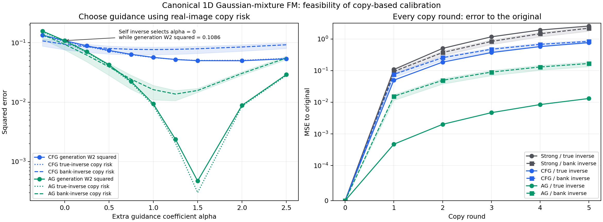

# 用真实图片的复制误差校准 guidance：一个完整 CPU 可行性实验

2026-09-13。这个实验得到一个明确但受限的正向结果：**可以固定公共反演器，仅用真实样本“输出应保持输入”的误差，选择现有 CFG / AG 的强度，并在独立生成分布上得到改善。** 不需要用生成质量指标选择强度，也不一定需要知道真实解析 CDF。它是可行性证明，不是新采样器，不代表超过已经充分调优的 CFG / AG，更不是图像模型上的质量结论。



[PNG](copy_calibration.png) · [可导出 PDF](copy_calibration.pdf) · [oracle 全部结果](results.json) · [经验 bank 全部结果](nonoracle_results.json)

图左：实线是独立生成 W₂²，点线为真实 oracle 逆下的 256 样本复制风险，虚线为经验 bank 逆的复制风险，阴影为 3 个 bank 的范围。图右每一轮都以最初输入为比较目标，包含 R0–R5；虚线与阴影为 bank 结果。不同反演器的曲线明确区分，不能当成完全相同操作。

**不要将两种误差同向变化算成两份独立证据。** 在本例的一维、单调、真实 oracle 耦合下，人口复制 MSE 和生成 W₂²本来就严格相等；左图同时绘出，是为了看有限真实样本能否选择合适强度。经验 bank 逆时该等式不再成立，独立生成评估才检验代理是否仍有用。

## 1. 固定模型与真正的复制操作

真实条件分布包含两个类内模式：

\[
P_* = \tfrac12 N(-2,.55^2)+\tfrac12 N(2,.55^2).
\]

强模型为两模式均值 ±1.7、标准差 .70；弱模型为均值 ±1.4、标准差 .85。二者都是同一条件任务的受控欠拟合：类内两模式往中心缩，模式内部变宽；弱模型两种偏差更大。它们不是独立随机错误，更不是从真实图像网络测得的误差规律。这种有方向的共同偏差是正向结果的设计前提。

真实 null 分布为 \(P_u=\frac12P_*+\frac12N(0,1.5^2)\)，后一项代表另一个类别。故 CFG 对比的是条件／无条件任务差异；AG 对比的是同一任务的强弱误差。两者不能在理论上混同。

每个混合高斯都采用相同 canonical Gaussian FM 路径

\[
Z_t=tX+(1-t)\epsilon,\quad\epsilon\sim N(0,1),
\]

并使用该分布的精确回归速度。分量 j 的均值为 tμⱼ、方差 \(s_j^2(t)=t^2\sigma_j^2+(1-t)^2\)，速度为

\[
v_j(z,t)=\mu_j+
\frac{t\sigma_j^2-(1-t)}{s_j^2(t)}(z-t\mu_j),
\]

再以当前 z 的分量 posterior 加权。这里没有用任意两条可逆曲线冒充规范 FM 模型。

记 \(G_\alpha\) 是 guided ODE 从 0 到 1 的生成映射。复制固定为

\[
T_\alpha(x)=G_\alpha(E(x)),\qquad x_{k+1}=T_\alpha(x_k).
\]

E 始终是公共参考，不能随被测 α 改变；没有新抽噪声。真实 oracle 为 \(E_*(x)=\Phi^{-1}(F_*(x))\)。在一维中，精确 FM 保持分位数，因此这就是其真实反向 ODE 的端点映射，不是另一个随意指定的编码器。

两种已有 guidance：CFG 用 \(v_s+\alpha(v_s-v_u)\)；AG 用 \(v_s+\alpha(v_s-v_w)\)。α 是额外系数，α=0 为原强条件模型。只扫描预先固定的十个 α：−.25、0、.25、.5、.75、1、1.25、1.5、2、2.5。

## 2. 为什么这个 toy 中校准复制有严格意义

真实 oracle 满足 \(E_*\#P_*=N(0,1)\)。对每个一维正则 ODE，生成映射 Gα 单调，因此 oracle 将真实 x 与生成输出配成最优运输耦合：

\[
\boxed{
\mathbb E_{X\sim P_*}|G_\alpha(E_*(X))-X|^2
=W_2^2(G_\alpha\#N(0,1),P_*).
}
\]

所以在这个指定范围内，人口复制误差确实能够排列生成分布质量。256 个真实样本的经验风险只近似这个人口风险，仍需独立测试；它不是误差任意情况下都有效的普遍命题。

高维一般只能得到上界，而不是排序等价。一个明确反例：目标 N(0,I₂)、E*=I，G_A 是旋转 90°，G_B=.9I。前者生成分布完全正确，复制 MSE=4；后者生成 W₂²=.02，复制 MSE=.02。复制损失会偏好后者，尽管分布变差。旋转可以作为 learned ODE 的误差存在，但不声称它与真实 canonical FM 场都是同一回归目标的精确最优解。

## 3. oracle 结果：只用真实复制风险选 α

使用 256 个独立真实 P* 样本，seed=2026091347。独立生成评估使用 2048 个标准高斯中点分位数，通过 guided ODE 生成，再与真实目标分位数计算 W₂²。生成指标没有进入 α 选择。

|方法|真实复制选择的额外 α|独立生成 W₂²|相对强模型|
|---|---:|---:|---:|
|强条件模型|0|.10861127|基线|
|原 CFG，经 oracle 复制校准|1.5|.04995932|降低 54.0%|
|原 AG，经 oracle 复制校准|1.5|.00047235|降低 99.565%|

这个结果只说明复制可用于选择已有方法的强度；其结果当然仍位于原 CFG / AG 分布族内。与真实生成风险直接调参可以找到什么最佳强度，是另一种带 oracle 质量信息的选择方式，不构成新的 baseline 战胜证据。

五轮复制均实际单独执行，比较对象始终是初始真实样本：

|方法|R1 MSE|R2|R3|R4|R5|
|---|---:|---:|---:|---:|---:|
|强模型|.108611|.504244|1.170659|1.918552|2.564434|
|弱模型|.382351|1.558807|2.721690|3.409901|3.796863|
|校准 CFG|.049959|.185501|.372538|.575437|.770281|
|校准 AG|.000472|.002007|.004689|.008457|.013160|

所有 R0–R5 样本坐标、相邻轮误差和对原图误差均保存在 [records.npz](records.npz)。强弱模型后期相邻轮变化可以缩小，同时距原输入越来越远；不能只报告“最后两轮更相似”。

## 4. 非 oracle：只用独立真实 bank 构造公共逆

额外采样 1024 个真实样本组成 bank；只把其数值交给编码器，不提供真实混合分量、均值、方差或解析 CDF。固定 KDE：

\[
F_B(x)=\frac1{1024}\sum_i\Phi((x-x_i)/h),\quad
E_B(x)=\Phi^{-1}(F_B(x)),
\]

带宽使用事先固定规则 \(h=.9\min(\widehat\sigma,\mathrm{IQR}/1.34)n^{-1/5}\)。没有利用真实解析密度、测试 W₂ 或生成图选择带宽。对三个预定 bank seed 重复；α 仍只使用同一批 bank 外 256 个真实样本的复制 MSE 选择。

CDF 尾部使用 log-CDF、log-survival 和 ndtri_exp，无截断；不会把已漂移的输出强制压回某个 prior 范围。独立测试中的真实 CDF 仅用于后验检查和分布质量评估，不进入 E_B 构造或校准。

|bank seed|带宽|CFG 所选 α|AG 所选 α|E_B#P* 到标准高斯的 W₂²|
|---:|---:|---:|---:|---:|
|2026091351|.468415|1.0|1.25|.022069|
|2026091352|.471234|1.0|1.25|.024610|
|2026091353|.459952|1.0|1.25|.015441|

三个 bank 的选择相同：CFG 的独立生成 W₂²=.05671625，比原强模型降低约 47.78%；AG 为 .00237340，降低约 97.815%。这是三次不同 bank 编码后的选择敏感性检查；生成器与已选 α 相同，因此相同生成 W₂不是三次独立生成试验。

经验编码器有明显偏差：其 heldout prior 标准差为 .875、.866、.914；不是标准高斯。所选 α 也不同于 oracle 的 1.5。**所以不能把非 oracle 复制风险当成真实 W₂，或说 bank 参考已经无偏。** 本结果只显示，在这个固定低维例子上，即使没有解析 oracle 编码器，操作仍能启动并选出比未校准强模型更好的现有 guidance。

准确地说，一维单调性此时使复制风险等于 \(W_2^2(G_\alpha\#(E_B\#P_*),P_*)\)，但生成使用的是标准高斯 prior。两种输入分布不同，正是代理可能偏向参考的来源。

同一 bank 参考下 R5 对初始图 MSE 的三个 seed 范围：强模型 1.760–2.429；校准 CFG .733–.913；校准 AG .134–.189。全部 R0–R5 坐标和每轮数值见 [nonoracle_records.npz](nonoracle_records.npz)、[nonoracle_results.json](nonoracle_results.json)。

## 5. 两个不可跳过的反方

**反演参考偏差。** 故意改为 \(E_s=G_s^{-1}\)，原强模型复制 MSE 约 1.3×10⁻²⁰，两种 guidance 都选择 α=0，但生成 W₂²仍是 .108611。这个错误 reference 的 heldout 编码分布距标准高斯 W₂²约 .06009。它说明不能用待测模型自己的完美 cycle 来选生成器。

对任意固定 E，记 \(\mu_E=E\#P_*\)、prior ν。若 G 是 Lipschitz 且二阶矩存在，三角不等式给出

\[
W_2(G\#\nu,P_*)
\le\mathrm{Lip}(G)W_2(\nu,\mu_E)
+\sqrt{\mathbb E_{P_*}\|G(E(X))-X\|^2}.
\]

所以除了真实逐图复制，还要关心公共逆把真实数据送到了什么 prior。若编码分布偏离生成时的 prior，低复制误差不覆盖所有生成输入；高维里两个分布看起来范数相近远远不够。高维该上界还可能很松，降低复制项本身不能保证降低真实 W₂。

**五轮排序也不自动正确。** 目标 N(0,1)、真实 E*=I。生成器 G₁(z)=z+.3 的单次 W₂²=.09，优于 G₂(z)=.5z 的 .25；但五轮原图 MSE 分别为 2.25 和 .93847656，排序反转。两者都可以是规范 Gaussian FM 的端点映射。故这里用单次真实复制风险校准，五轮只检查原观察中的误差累积，不将五轮稳定性直接替代单次生成质量。

## 6. 能否只训练轻量 guidance

可以定义清楚的目标，无需改完整模型：固定 E，冻结 conditional / null 或 strong / weak 网络，只学习标量 α，或极少数时间基函数的系数 φ：

\[
L(\varphi)=\mathbb E_{(x,c)\sim\mathrm{real}}
\|G_\varphi(E_c(x),c)-x\|^2.
\]

这是利用真实样本当复制目标的轻量校准。当前 toy 已完成其中的单标量版本；没有训练新的生成网络，也没有以 future 信息或小 cycle 为监督。

最小下一步应保留本例已经验证的次序：先固定可检查的公共 E 和独立真实样本；预先固定很小的 guidance 参数族；仅按单次复制风险校准；在独立样本上报告生成质量和五轮原图保留。若 E 的 heldout prior 检查不支持它覆盖生成 prior，就不能从复制结果直接推断生成收益。高维经验 bank 的可逆构造、维度与参考偏差问题见[经验 bank 反演审查](../identity_operator_20260913/empirical_bank_encoder.md)。

这仍不是保证图像实验成功的方案。当前可接受的结论是：原始“真实图像应被保留”的要求可以提供有真实数据锚点的校准信号；在可证的一维范围内，它直接对应生成风险；放到高维之前，必须保留公共逆的来源、prior 匹配和独立质量检查。

## 7. 复现与数值检查

源码根目录：[experiments/identity_copy_toy_20260913](../../../experiments/identity_copy_toy_20260913/README.md)。

```bash
OPENBLAS_NUM_THREADS=1 OMP_NUM_THREADS=1 python -m experiments.identity_copy_toy_20260913.run
OPENBLAS_NUM_THREADS=1 OMP_NUM_THREADS=1 python -m experiments.identity_copy_toy_20260913.nonoracle
OPENBLAS_NUM_THREADS=1 OMP_NUM_THREADS=1 python -m experiments.identity_copy_toy_20260913.analyze
```

DOP853 的原生四种 FM 端点与精确分位数映射最大偏差不超过 3×10⁻¹¹；真实 oracle 逆／正复合误差约 2.7×10⁻¹⁵。guided endpoint 单调性全通过，人口复制 MSE 与一维生成 W₂²的数值差为零。两阶段分别约 8.8 秒与 12.4 秒 CPU；该时间只是本机数学 toy 成本，不代表神经图像采样速度。

模型、所有 α、seed、带宽规则、源码 SHA256、生成端点、真实输入、公共逆坐标及每轮坐标均已保存。没有 GPU、全模型训练、FID 或图像模型实验。
